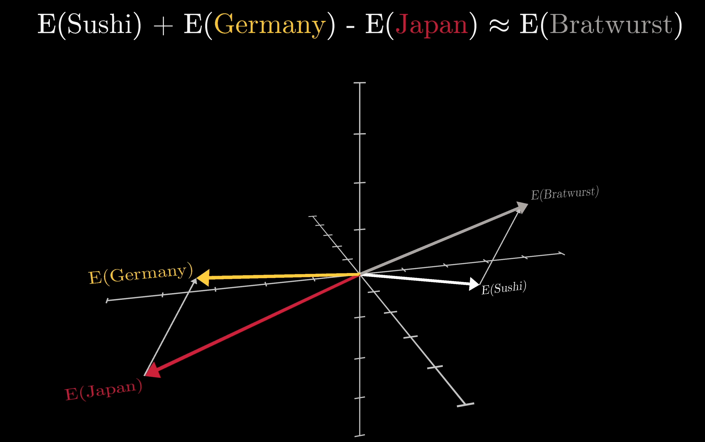

## ML: The basics {.smaller}

:::: {.columns}
::: {.column width="50%"}
- **Loss function**  
  measures how wrong the model is
- **Gradient descent**  
  nudge weights down the loss surface
- **Backpropagation**  
  efficiently compute gradients layer by layer
- **Overfitting**  
  learns training data *too well*, poor on new data
:::
::: {.column width="50%"}
```{mermaid}
%%{init: {"flowchart": {"nodeSpacing": 15, "rankSpacing": 18}, "theme": "base", "themeVariables": {"edgeLabelBackground": "#ffffff"}}}%%
flowchart TD
    A([Training data]) --> B["Forward pass (→ see next slide)"]
    B --> C[Compute loss]
    C --> D[Backpropagation]
    D --> E[Update weights]
    E -->|repeat| B
    C -->|loss small enough| F([Done ✓])

    classDef io     fill:#6c757d,stroke:#495057,color:#fff
    classDef step   fill:#4b9cd3,stroke:#2c6e9e,color:#fff
    classDef key    fill:#003b6f,stroke:#001f3f,color:#fff

    class A,F io
    class B,C step
    class D,E key
```
:::
::::

::: {.notes}
Overfitting is a major concern in classical ML, but large transformer models largely sidestep it. They have billions of parameters (far more than training examples), yet generalise well. Key reasons: (1) vast and diverse training data makes true memorisation impractical; (2) regularisation techniques such as dropout and weight decay are baked in; (3) the double-descent phenomenon: very over-parameterised models can re-enter a good-generalisation regime; and (4) emergent representations learned across billions of tokens capture structure rather than surface patterns.
:::

## Transformers: Inference {.smaller}

:::: {.columns}
::: {.column width="45%"}
::: {.fragment fragment-index=1}
- **Tokenise** text → sub-word tokens
:::
::: {.fragment fragment-index=2}
- **Embed** tokens → dense vectors
- **Positional encoding** inject token order
:::
::: {.fragment fragment-index=3}
- **Self-attention** every token attends to every other *in parallel*
:::
::: {.fragment fragment-index=4}
- **MLP** per-token transform
- Repeat × N layers, then **softmax → next token**^[Not always the most likely token. Sampling strategies include temperature, top-k, top-p]
:::
::: {.fragment fragment-index=5}
- **Softmax → predict next token**
:::
::: {.fragment fragment-index=6}
- Predicted token appended to input, process repeats, one token at a time
:::
:::

::: {.column width="55%"}
::: {.r-stack style="min-height: 520px;"}

::: {.fragment .fade-in-then-out fragment-index=1}
```{mermaid}
%%{init: {"flowchart": {"nodeSpacing": 20, "rankSpacing": 35}, "theme": "base", "themeVariables": {"edgeLabelBackground": "#ffffff"}}}%%
flowchart TD
    A([Input text]) --> B[Tokenise]
    classDef io   fill:#6c757d,stroke:#495057,color:#fff
    classDef prep fill:#4b9cd3,stroke:#2c6e9e,color:#fff
    class A io
    class B prep
```
:::

::: {.fragment .fade-in-then-out fragment-index=2}
```{mermaid}
%%{init: {"flowchart": {"nodeSpacing": 20, "rankSpacing": 35}, "theme": "base", "themeVariables": {"edgeLabelBackground": "#ffffff"}}}%%
flowchart TD
    A([Input text]) --> B[Tokenise]
    B --> C[Embed + pos. encoding]
    classDef io   fill:#6c757d,stroke:#495057,color:#fff
    classDef prep fill:#4b9cd3,stroke:#2c6e9e,color:#fff
    class A io
    class B,C prep
```
:::

::: {.fragment .fade-in-then-out fragment-index=3}
```{mermaid}
%%{init: {"flowchart": {"nodeSpacing": 20, "rankSpacing": 35}, "theme": "base", "themeVariables": {"edgeLabelBackground": "#ffffff"}}}%%
flowchart TD
    A([Input text]) --> B[Tokenise]
    B --> C[Embed + pos. encoding]
    C --> D[Self-attention]
    classDef io   fill:#6c757d,stroke:#495057,color:#fff
    classDef prep fill:#4b9cd3,stroke:#2c6e9e,color:#fff
    classDef core fill:#003b6f,stroke:#001f3f,color:#fff
    class A io
    class B,C prep
    class D core
```
:::

::: {.fragment .fade-in-then-out fragment-index=4}
```{mermaid}
%%{init: {"flowchart": {"nodeSpacing": 20, "rankSpacing": 35}, "theme": "base", "themeVariables": {"edgeLabelBackground": "#ffffff"}}}%%
flowchart TD
    A([Input text]) --> B[Tokenise]
    B --> C[Embed + pos. encoding]
    C --> D[Self-attention]
    D --> E["Feed-forward (× N layers)"]
    classDef io   fill:#6c757d,stroke:#495057,color:#fff
    classDef prep fill:#4b9cd3,stroke:#2c6e9e,color:#fff
    classDef core fill:#003b6f,stroke:#001f3f,color:#fff
    class A io
    class B,C prep
    class D,E core
```
:::

::: {.fragment .fade-in-then-out fragment-index=5}
```{mermaid}
%%{init: {"flowchart": {"nodeSpacing": 20, "rankSpacing": 35}, "theme": "base", "themeVariables": {"edgeLabelBackground": "#ffffff"}}}%%
flowchart TD
    A([Input text]) --> B[Tokenise]
    B --> C[Embed + pos. encoding]
    C --> D[Self-attention]
    D --> E["Feed-forward (× N layers)"]
    E --> F([Predict next token])
    classDef io   fill:#6c757d,stroke:#495057,color:#fff
    classDef prep fill:#4b9cd3,stroke:#2c6e9e,color:#fff
    classDef core fill:#003b6f,stroke:#001f3f,color:#fff
    class A,F io
    class B,C prep
    class D,E core
```
:::

::: {.fragment fragment-index=6}
```{mermaid}
%%{init: {"flowchart": {"nodeSpacing": 20, "rankSpacing": 35}, "theme": "base", "themeVariables": {"edgeLabelBackground": "#ffffff"}}}%%
flowchart TD
    A([Input text]) --> B[Tokenise]
    B --> C[Embed + pos. encoding]
    C --> D[Self-attention]
    D --> E["Feed-forward (× N layers)"]
    E --> F([Predict next token])
    F -.->|autoregressive| A2([Input text])
    classDef io   fill:#6c757d,stroke:#495057,color:#fff
    classDef prep fill:#4b9cd3,stroke:#2c6e9e,color:#fff
    classDef core fill:#003b6f,stroke:#001f3f,color:#fff
    class A,A2,F io
    class B,C prep
    class D,E core
```
:::

:::
:::
::::

::: {.notes}
The crucial innovation is self-attention: rather than processing tokens in sequence (like an RNN), every token attends to every other token in parallel. This lets the model capture long-range dependencies and scales well on modern hardware.
:::


## Embeddings encode meaning {.smaller}

:::: {.columns}
::: {.column width="50%"}
The **input embedding matrix** maps tokens to vectors. Directions encode semantic relationships:

<!-- ::: {style="background:#1a1a2e; color:#fff; padding:0.5em 1em; border-radius:6px; font-size:0.9em; text-align:center; margin:0.5em 0;"}
E(Sushi) + E(Germany) − E(Japan) ≈ E(Bratwurst)
::: -->

- The food/country direction generalises across many pairs: 
  - pizza / Italy, tacos / Mexico

:::
::: {.column width="50%"}
{width="80%"}
:::
::::

::: {style="margin-top:0.8em; font-size:0.85em; color:#555; border-left: 3px solid #4b9cd3; padding-left:0.5em;"}
These patterns exist *before* attention runs. Attention enriches each vector with context, distinguishing "bank" (river) from "bank" (finance).
:::

::: {.attribution}
3Blue1Brown, [Deep Learning Ch. 5](https://www.3blue1brown.com/lessons/gpt)
:::

## Agentic AI {.smaller}

:::: {.columns}
::: {.column width="50%"}
- **LLM**: generates text, reasons, and decides whether to act or answer
- **System prompt**: the agent's "config", defines its role, tools, and behaviour
- **Context window**: all state lives here: prompt, results, reasoning
- **Planning**: CoT/ReAct, model reasons step by step before acting
:::
::: {.column width="50%"}
- **Tools**: search, code execution, APIs, RAG. Agent decides when to invoke each
- **Termination**: done when LLM produces a final answer, or `max_iterations` is hit
:::
::::

```{mermaid}
%%{init: {"flowchart": {"nodeSpacing": 40, "rankSpacing": 80}, "theme": "base", "themeVariables": {"edgeLabelBackground": "#ffffff"}}}%%
flowchart LR
    S([System prompt]) --> C
    H([Prompt]) --> C["Context window"]
    C --> L["LLM: generate text"]
    L --> D{Tool call?}
    D -->|yes| T["Tools (incl. RAG)"]
    T -->|result appended| C
    D -->|no| O([Output])

    classDef io      fill:#6c757d,stroke:#495057,color:#fff
    classDef core    fill:#003b6f,stroke:#001f3f,color:#fff
    classDef support fill:#4b9cd3,stroke:#2c6e9e,color:#fff
    classDef decision fill:#e9c46a,stroke:#f4a261,color:#000

    class S,H,O io
    class L core
    class C,T support
    class D decision
```

::: {.notes}
An agentic system wraps an LLM in a loop: the model receives a prompt, decides whether it needs more information or to take an action, calls a tool if so, gets the result back in its context, and repeats until it decides it is done.

The key components:
- **LLM**: does all the reasoning:it reads the context, decides what to do next, and generates either a tool call or a final answer.
- **Tools**: external capabilities the LLM can invoke:web search, a code interpreter, database queries, API calls. The LLM doesn't execute these itself; the surrounding framework does and appends the result to the context.
- **Memory / RAG**: retrieved documents or prior conversation history injected into the context before the LLM runs. This is how agents can work with knowledge beyond their training cutoff or access private data.
- **Planning**: some agents explicitly decompose a task into sub-steps before acting (ReAct, chain-of-thought, tree-of-thought). Others just iterate implicitly.

A key point for an RSE audience: the LLM itself is stateless:all state lives in the context window. The "loop" is managed by the surrounding application code, not the model.
:::

## Tooling 
- MCP - connecting models to the outside world (Tom...)

## References & Further Reading{.smaller}
**Foundational concepts**

- 3Blue1Brown: [Neural Networks playlist](https://www.youtube.com/playlist?list=PLZHQObOWTQDNU6R1_67000Dx_ZCJB-3pi) [@3blue1brown_nn]
- Andrej Karpathy: [Neural Networks: Zero to Hero](https://www.youtube.com/playlist?list=PLAqhIrjkxbuWI23v9cThsA9GvCAUhRvKZ) [@karpathy_zero_to_hero]

**Transformers**

- Stanford CS25: [Transformers United](https://web.stanford.edu/class/cs25/) [@stanford_cs25]

**Reinforcement Learning & Alignment**

- Hugging Face: [Deep RL Course](https://huggingface.co/learn/deep-rl-course) [@huggingface_deep_rl]
- OpenAI: [Spinning Up in Deep RL](https://spinningup.openai.com) [@openai_spinningup]
