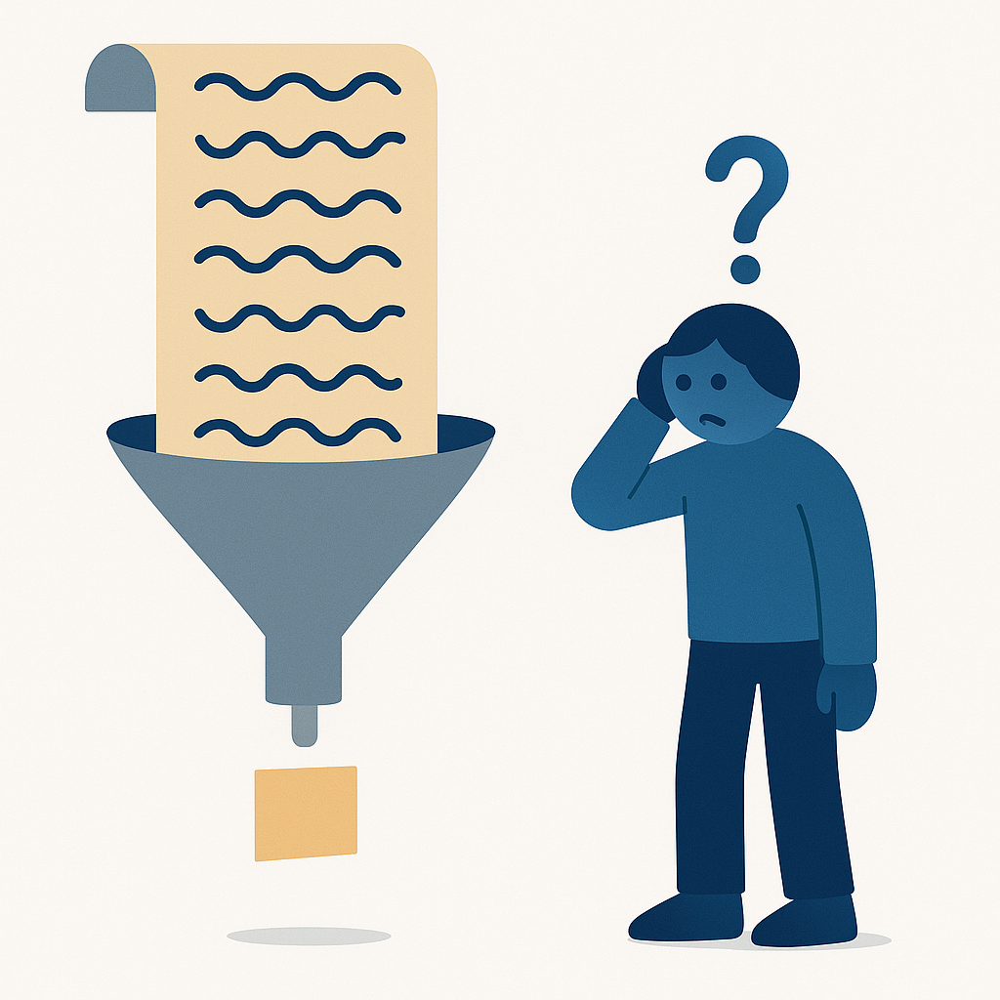

## In collaboration with {.center}

::: {.partner-logos}
[Institutions behind this session]{.partner-label}

::: {.partner-tier .partner-host}
{fig-alt="University of Cambridge — Institute of Computing for Climate Science"}
:::

::: {.partner-tier .partner-affiliates}


:::
:::

## Plan

- How we got here: ~70 years of GenAI as a timeline
- Inside a transformer: tokens, embeddings, attention, inference
- From next-word prediction to assistants, agents, and MCP
- Tooling overview and code demo
- Opencode intro and configuration
- Create your own tool call with MCP + Skills

::: {.notes}
Two halves today. In the first half I'll cover the concepts you need — but instead of walking through them one-by-one as a glossary, we'll follow the timeline. Every concept in modern GenAI was invented to fix a specific failure someone hit. If you know the problem, the concept becomes obvious — and you'll also get a feel for *when* you need the cathedral and when you just need a hammer.

In the second half Tom takes over and you'll get hands-on: opencode, self-hosted LLMs, and building your own MCP tools and skills.

This part of the talk is adapted from my series "How We Got Here" — a 25-part history of GenAI. Link at the end.
:::


## How We Got Here

:::: {.columns}
::: {.column width="55%"}
{width="100%" style="margin-top: 2.5em;" fig-alt="A winding road through computing history, from a 1950s cabinet computer with dials, past a beige workstation and GPU boards, to a modern laptop with a chat bubble and robotic arm."}
:::
::: {.column width="45%"}
::: {.incremental style="font-size: 0.8em; margin-top: 2em; line-height: 1.5;"}
- Every concept in GenAI was an answer to a problem someone hit
- So we'll walk the timeline instead of a glossary
- Destination: what is inside the tools you'll use this afternoon
:::
:::
::::

::: {.notes}
The tools you'll use this afternoon — coding agents, MCP servers, skills — look like magic if you meet them cold. They stop looking like magic once you see the chain of problems and fixes that produced them. None of it was ever magic: a sequence of understandable moves, each one standing on the last.

A recurring pattern to watch for: at almost every stop, the idea wasn't wrong — it was early. And the field repeatedly confused "I can't see how" with "it can't be done."
:::


## If You Remember Nothing Else

::: {.incremental style="font-size: 1.05em; line-height: 1.9; margin-top: 1.5em;"}
1. **Every AI model is the same machine.**
2. **Your model is only as good as your harness.**
3. **Generative AI tools are powerful but fragile.**
:::

::: {.notes}
Before we start the timeline, here's the whole talk in three sentences. If you drift off after lunch, these are the three things to leave with.

One: every AI model is the same machine. From the 1958 perceptron to the frontier model you'll use this afternoon, it's the same unit — inputs, weights, sum, threshold — arranged and scaled, trained by the same loop. Once you see that, none of it is magic.

Two: your model is only as good as your harness. The model just predicts the next token; everything useful — tools, context, MCP servers, skills — comes from the machinery you wrap around it. That's why the second half of today is about the harness, not the model.

Three: generative AI tools are powerful but fragile. They can do remarkable work and fail silently in the same minute — hallucination, prompt injection, brittle context. Use them, but verify them.

Everything on the timeline is evidence for one of these three.
:::


# {#act-1 background-color="#003b6f"}

::: {style="text-align: center; margin-top: 2.2em;"}
[Act I]{.act-kicker}

[1958 – 2012]{.act-years}

[Learning from data]{.act-name}
:::

::: {.notes}
Act one: half a century of teaching machines to learn from examples — and two winters where the field stopped believing it was possible.
:::


## 1958: The Perceptron

::: {.timeline-strip}
[1958]{.tl-stop .tl-now} [›]{.tl-sep} [1969]{.tl-stop} [›]{.tl-sep} [1986]{.tl-stop} [›]{.tl-sep} [2012]{.tl-stop} [›]{.tl-sep} [2017]{.tl-stop} [›]{.tl-sep} [2020]{.tl-stop} [›]{.tl-sep} [2022]{.tl-stop} [›]{.tl-sep} [2024]{.tl-stop} [›]{.tl-sep} [now]{.tl-stop}
:::

::: {.era-tagline}
The 1958 machine you're still using
:::

:::: {.columns}
::: {.column width="55%"}
::: {.incremental style="font-size: 0.85em;"}
- Inputs, weights, sum, threshold — no layers, no magic
- Weights are dials: learn by nudging them on every mistake
- Geometrically: learning to draw a line between two classes
- Still the irreducible unit of every model you use
:::
:::
::: {.column width="45%"}
```{mermaid}
%%| fig-height: 3.5
%%{init: {"flowchart": {"nodeSpacing": 12, "rankSpacing": 25}, "theme": "base", "themeVariables": {"edgeLabelBackground": "#ffffff"}}}%%
flowchart LR
    x1([x₁]) -->|w₁| S["Σ"]
    x2([x₂]) -->|w₂| S
    x3([x₃]) -->|w₃| S
    S --> T["&gt; θ ?"]
    T --> O(["0 / 1"])

    classDef io   fill:#6c757d,stroke:#495057,color:#fff
    classDef key  fill:#003b6f,stroke:#001f3f,color:#fff
    classDef step fill:#4b9cd3,stroke:#2c6e9e,color:#fff

    class x1,x2,x3,O io
    class S key
    class T step
```
:::
::::

::: {.notes}
Frank Rosenblatt, a psychologist at Cornell, 1958. The Mark I Perceptron was hardware: a 20×20 grid of photocells, and the weights were physical potentiometers turned by electric motors. When Rosenblatt said "neural network", he meant a wall of motors turning knobs.

The learning rule: show it a labelled example; if it guesses wrong, nudge the offending weights in the direction that would have produced the right answer. Repeat ten thousand times. The Perceptron Convergence Theorem guaranteed that if a correct set of weights exists, this procedure finds it in a finite number of steps.

The New York Times, July 1958: a machine that would eventually "walk, talk, see, write, reproduce itself and be conscious." The hype cycle is not new.

The single perceptron is to modern AI what the transistor is to modern computing: everything since is this unit, arranged.
:::


## 1969: The Wall

::: {.timeline-strip}
[1958]{.tl-stop} [›]{.tl-sep} [1969]{.tl-stop .tl-now} [›]{.tl-sep} [1986]{.tl-stop} [›]{.tl-sep} [2012]{.tl-stop} [›]{.tl-sep} [2017]{.tl-stop} [›]{.tl-sep} [2020]{.tl-stop} [›]{.tl-sep} [2022]{.tl-stop} [›]{.tl-sep} [2024]{.tl-stop} [›]{.tl-sep} [now]{.tl-stop}
:::

::: {.era-tagline}
The book that almost killed neural networks
:::

:::: {.columns}
::: {.column width="58%"}
::: {.incremental style="font-size: 0.85em;"}
- Minsky & Papert prove a single-layer perceptron **cannot** compute XOR
- The proof was correct — and still is
- The lethal move was extrapolation: multi-layer networks declared "sterile"
- Funding dried up: the first AI winter
:::
:::
::: {.column width="42%"}
{width="82%" style="display: block; margin: 0.5em auto 0 auto;" fig-alt="A brick wall blocks a winding path, but a small door in the wall stands ajar with light shining through; a heavy closed book leans against the wall."}
:::
::::

::: {.notes}
1969: Marvin Minsky and Seymour Papert publish "Perceptrons". The XOR theorem is impeccable mathematics — a single layer can only separate linearly-separable classes. That result has never been overturned.

But the damage came from the leap: they called the multi-layer extension "sterile", and the field read that as "neural networks are a dead end." The extension they dismissed turned out to be the entire engineering future of AI.

The twist: Minsky was a believer first — he built one of the first neural-net learning machines (SNARC, 1951). And the fight was partly about a finite pot of DARPA funding.

The lesson worth keeping: the right question is never just "is the math correct?" — it's "what is the gap between the specific limit the math proves and the general claim being built on top of it?" That gap is where decades get lost.

Rosenblatt died in a boating accident in 1971 and never saw the revival. Recurring theme in this history: many of the pioneers never got to read the ending.
:::


## 1986: Backpropagation

::: {.timeline-strip}
[1958]{.tl-stop} [›]{.tl-sep} [1969]{.tl-stop} [›]{.tl-sep} [1986]{.tl-stop .tl-now} [›]{.tl-sep} [2012]{.tl-stop} [›]{.tl-sep} [2017]{.tl-stop} [›]{.tl-sep} [2020]{.tl-stop} [›]{.tl-sep} [2022]{.tl-stop} [›]{.tl-sep} [2024]{.tl-stop} [›]{.tl-sep} [now]{.tl-stop}
:::

::: {.era-tagline}
One wrong answer, a billion dials — how a network learns who to blame
:::

::: {.incremental style="line-height: 1.5; font-size: 0.95em;"}
- Loss function: measures model error
- Gradient descent: moves weights down the loss surface
- Backpropagation: blame flows backward, layer by layer (chain rule)
- Overfitting: memorises training data, fails to generalise
:::

::: {.notes}
This is the "credit assignment" problem — a term coined by Minsky himself. A model reads a handwritten 2 and confidently says 8. Which of a billion dials do you turn, and by how much?

The answer: measure how *sensitive* the final error is to each weight — that's all a derivative is here. Innocent weights barely move the cost; guilty weights send it flying. The error signal flows backward through the network, and each connection computes its own share of the blame locally. You never have to tell the middle layers the right answer.

The engine is nothing exotic — just the chain rule, used with discipline. The wall Minsky pointed at was real, but the door was sitting in a freshman calculus textbook. Werbos worked it out in his 1974 dissertation and offered Minsky a co-authored correction; Minsky declined. It took until Rumelhart, Hinton & Williams' 1986 Nature paper (six pages) for the field to listen.

Standard ML-basics framing still applies: supervised learning on input-output pairs, differentiable loss, gradient descent on the loss surface.

Overfitting is the classic failure mode in classical ML. Worth noting: large transformer models largely sidestep it — vast and diverse data, regularisation (dropout, weight decay), the double-descent phenomenon, and emergent representations that capture structure rather than surface patterns.

Backprop's gift wasn't intelligence — it was *correctability*: the ability to be wrong and to know exactly who to blame.
:::


## 1986: The Training Loop

:::{style="display: block; margin: 0 auto; text-align: center; margin-top: 1em;"}
```{mermaid}
%%| fig-height: 5
%%{init: {"flowchart": {"nodeSpacing": 15, "rankSpacing": 18}, "theme": "base", "themeVariables": {"edgeLabelBackground": "#ffffff"}}}%%
flowchart TD
    A([Training data]) --> B["Forward pass"]
    B --> C[Compute loss]
    C --> D[Backpropagation]
    D --> E[Update weights]
    E -->|repeat| B
    C -->|loss small enough| F([Done ✓])

    classDef io     fill:#6c757d,stroke:#495057,color:#fff
    classDef step   fill:#4b9cd3,stroke:#2c6e9e,color:#fff
    classDef key    fill:#003b6f,stroke:#001f3f,color:#fff

    class A,F io
    class B,C step
    class D,E key
```
:::

::: {.notes}
This loop is the same whether you're training a 1986 XOR network or a frontier model today. Forward pass, compute loss, backpropagate blame, update weights, repeat until the loss is small enough.

Everything that follows in this talk — CNNs, transformers, GPT, RLHF, reasoning models — is trained with this exact loop. Only the architecture and the loss signal change. Keep that in mind: whenever something later looks like magic, it's this loop underneath.
:::


## 1989–2006: Winters and Stubborn Ideas

::: {.timeline-strip}
[1958]{.tl-stop} [›]{.tl-sep} [1969]{.tl-stop} [›]{.tl-sep} [1986]{.tl-stop} [›]{.tl-sep} [90s]{.tl-stop .tl-now} [›]{.tl-sep} [2012]{.tl-stop} [›]{.tl-sep} [2017]{.tl-stop} [›]{.tl-sep} [2022]{.tl-stop} [›]{.tl-sep} [now]{.tl-stop}
:::

::: {.incremental style="font-size: 0.9em;"}
- **1989** — LeCun's convolutional network reads real ZIP codes: *structure is knowledge*
- **1990s** — SVMs win on clean math and guarantees; deep nets stall on the **vanishing gradient**
- **2006** — Hinton's layer-wise pretraining revives depth, under a new name: **deep learning**
:::

::: {.notes}
Three beats, quickly.

1989: Yann LeCun at Bell Labs trains a convolutional network on real mail from Buffalo — the first neural network with a day job. By the early 2000s its descendant read ~10% of all US checks. The key idea: bake what you already know into the architecture (a pattern worth finding in one place is worth finding everywhere), so the network's capacity goes to what actually needs learning. "Structure is knowledge" — remember this phrase, it comes back with transformers and with tool use.

1990s: Support Vector Machines (Vapnik & Cortes, 1995 — written down the hall from LeCun) beat neural networks fair and square: convex optimisation, one best answer, real theory. Meanwhile deep nets hit the vanishing gradient: with sigmoid activations, the blame signal shrinks at every layer going backward — after twenty layers, a millionth. The one thing that could make neural nets special (depth) was exactly what wouldn't train. Second winter.

2006: Hinton, Osindero & Teh train deep networks one layer at a time — greedy unsupervised pretraining, then fine-tune the whole stack. The trick itself became obsolete within a few years (better initialisation + ReLU + GPUs let you train from scratch), but it granted the field *permission* to go deep again — and the pretrain-then-fine-tune workflow you use every time you call `from_pretrained` was born here. They also rebranded: "neural networks" was radioactive, so they called it *deep learning*.

The pattern in all three: being better and being believed are different things.
:::


## 2012: AlexNet — The Year the Dam Broke

::: {.timeline-strip}
[1958]{.tl-stop} [›]{.tl-sep} [1969]{.tl-stop} [›]{.tl-sep} [1986]{.tl-stop} [›]{.tl-sep} [90s]{.tl-stop} [›]{.tl-sep} [2012]{.tl-stop .tl-now} [›]{.tl-sep} [2017]{.tl-stop} [›]{.tl-sep} [2022]{.tl-stop} [›]{.tl-sep} [now]{.tl-stop}
:::

::: {.stat-row}
[26%[2011 best, top-5 error]{.stat-label}]{.stat}
[→]{.stat-arrow}
[15%[AlexNet, 2012]{.stat-label}]{.stat}
[·]{.stat-arrow}
[2[gaming GPUs]{.stat-label}]{.stat}
:::

::: {.incremental style="font-size: 0.9em;"}
- Nothing new in the network — the world finally supplied **data + compute**
- ReLU dodges the vanishing gradient; dropout tames overfitting
- "Just make it bigger" is born; scale becomes the moat
:::

::: {.notes}
2012, the ImageNet challenge: 1.2M labelled images, 1000 categories. Best systems (hand-designed features + SVMs) plateaued around 26% top-5 error. AlexNet — Krizhevsky, Sutskever, Hinton — comes in at ~15%. That's not an improvement, it's a different weather system. Within months every serious lab changed direction.

And the architecture? A deep convolutional network — LeCun's 1989 idea, finally cashing its cheque. What changed wasn't the idea:

- Data: Fei-Fei Li's ImageNet — 14M hand-labelled images, mocked at the time as too big, too manual, too unglamorous.
- Compute: two NVIDIA GTX 580 gaming cards. The compute that unlocked modern AI arrived as hardware a teenager might have under their desk.
- Two small tricks: ReLU (pass positives straight through — dodges the vanishing gradient) and dropout (break the network on purpose during training so it holds up in the real world).

The bill: if wins come from data and compute, the question becomes *who has the data and the GPUs?* At the frontier, scale is the moat — that's still the industry structure you live in today.

Rosenblatt (d. 1971) and Rumelhart (d. 2011) never saw it.
:::


# {#act-2 background-color="#003b6f"}

::: {style="text-align: center; margin-top: 2.2em;"}
[Act II]{.act-kicker}

[2013 – 2020]{.act-years}

[The machine learns to read]{.act-name}
:::

::: {.notes}
Act two: vision fell to scale, but language resisted. This act is how text became numbers, how attention broke the bottleneck, and how the transformer let language finally soak up all the compute.
:::


## The Next Problem: Language

::: {.incremental}
- Vision fell to scale — but language resisted
- An image is a grid, all present at once
- A sentence is a **sequence**: "bank" needs memory of what came before
- And first: how do you feed text to a machine that only does arithmetic?
:::

::: {.notes}
Transition slide. Seeing was hard; reading turned out to be harder. An image has no "before" and "after" — a sentence does, and meaning depends on order and context.

Before any of that, there's a plumbing question the next two slides answer: models do arithmetic on numbers, so text has to become numbers in a way that preserves meaning. Two steps: tokenisation (text to integer IDs) and embeddings (IDs to vectors where geometry encodes meaning).
:::


## LLMs: Tokenisation

::: {style="font-size: 0.9em;"}
LLMs cannot process raw text, it must first be converted to numbers.
:::

::: {.incremental style="font-size: 0.9em; line-height: 1.4;"}
- Text is split into **sub-word tokens** using a learned vocabulary
- Each token is assigned a unique integer ID
- Common words are single tokens; rare words split into pieces
:::

:::{.fragment style="margin-top: 0.8em;"}
:::{style="font-family: monospace; font-size: 0.8em; color: #333;"}
"I went to the"
:::
:::{style="display: flex; gap: 0.4em; font-family: monospace; font-size: 0.75em;"}
[235285 "I"]{style="background:#4b9cd3; color:#fff; padding: 0.2em 0.6em; border-radius: 4px;"}
[3806 "▁went"]{style="background:#4b9cd3; color:#fff; padding: 0.2em 0.6em; border-radius: 4px;"}
[576 "▁to"]{style="background:#4b9cd3; color:#fff; padding: 0.2em 0.6em; border-radius: 4px;"}
[573 "▁the"]{style="background:#4b9cd3; color:#fff; padding: 0.2em 0.6em; border-radius: 4px;"}
:::
:::

::: {.notes}

we're dealing with text, but the model operates on numbers. So the first step is tokenisation: converting raw text into a sequence of token IDs.

We break text into sub-word tokens as otherwise the vocabulary would be too large. We can instead use the tokens as building blocks to represent any word. This makes the vocabulary more manageable and allows the model to handle rare or technical words by breaking them into pieces.

Tokenisation is the first step in the pipeline. The tokeniser is a separate component from the LLM — it ships as a vocabulary file and a set of merge rules (BPE or SentencePiece).
The vocabulary size for Gemma is ~256k tokens.

Sub-word tokenisation means common words like "the" are a single token, while rare or technical words like "backpropagation" split into pieces: ▁back, prop, agation.
:::

## 2013: Meaning Becomes Geometry

::: {.era-tagline}
word2vec: king − man + woman ≈ queen
:::

::: {style="font-size: 0.85em;"}
The embedding matrix maps tokens to vectors; directions encode meaning.
:::

:::{style="text-align: center; margin-top: 0.3em;"}
{width="46%" fig-alt="A 3D vector space showing that the displacement from E(Japan) to E(Germany) approximately equals the displacement from E(Sushi) to E(Bratwurst), illustrating that directions in embedding space encode meaning."}
:::

::: {style="font-size: 0.75em; color:#555; margin-top: 0.3em;"}
Attention enriches each vector with context: bank (river) vs bank (finance)
:::

::: {.attribution}
3Blue1Brown, [Deep Learning Ch. 5](https://www.3blue1brown.com/lessons/gpt)
:::

::: {.notes}
Timeline stop: 2013, word2vec (Mikolov, Google). The discovery that made language tractable: meaning can become *location*. Words map to vectors, and directions in that space encode relationships.

We need to convert tokens to vectors before the model can process them — the model operates in a continuous vector space, not discrete token IDs. The embedding matrix maps each token ID to a dense vector.

These vectors capture semantic meaning — similar words have similar embeddings. "king" and "queen" are close; "king" and "carrot" are far apart.

$\text{king} - \text{man} + \text{woman} \approx \text{queen}$

In practice this exact relationship isn't very accurate (queen has multiple meanings), but the point stands: directions encode meaning.

In this example the displacement between germany and japan is approximately the same as between bratwurst and sushi. The food/country direction generalises: pizza/Italy, tacos/Mexico, sushi/Japan. These patterns exist before attention runs. Attention enriches each vector with context, distinguishing "bank" (river) from "bank" (finance).

File this away for later too: this same "meaning becomes location" trick is what powers RAG and vector databases this afternoon.
:::


## 2014: Attention — The Bottleneck

::: {.timeline-strip}
[1958]{.tl-stop} [›]{.tl-sep} [1986]{.tl-stop} [›]{.tl-sep} [2012]{.tl-stop} [›]{.tl-sep} [2014]{.tl-stop .tl-now} [›]{.tl-sep} [2017]{.tl-stop} [›]{.tl-sep} [2020]{.tl-stop} [›]{.tl-sep} [2022]{.tl-stop} [›]{.tl-sep} [now]{.tl-stop}
:::

::: {.era-tagline}
Stop making the machine work from memory — let it look back
:::

:::: {.columns}
::: {.column width="60%"}
::: {.incremental style="font-size: 0.82em;"}
- RNNs read one token at a time, carrying a running "mental note"
- seq2seq: the whole sentence crushed into **one fixed-size vector**
- Like translating a paragraph from a single sticky note
- Bahdanau 2014: keep everything, let the decoder **look back** with learned soft weights
- But attention was bolted onto RNNs — sequential, GPUs sitting idle
:::
:::
::: {.column width="40%"}
{width="82%" style="display: block; margin: 0.5em auto 0 auto;" fig-alt="A long scroll of text is squeezed through a funnel, producing a single tiny sticky note that a confused reader stares at."}
:::
::::

::: {.notes}
The 1990s-2014 approach to language: recurrent networks (RNNs). Read a word, update a running mental note (the hidden state), repeat. LSTMs (1997) added learned gates for what to keep and forget — that's what powered Google Translate's big 2016 jump.

The wall: encoder-decoder translation crushed the entire source sentence into one fixed-size vector, and the decoder had to rebuild everything from just that. Read a paragraph once, write yourself one sticky note, hand the paragraph away, now translate. Quality fell off a cliff past a certain sentence length. One fixed-size vector is not enough room to hold a long thought.

The fix (Bahdanau, Cho & Bengio, 2014) was almost too simple to trust: keep all the encoder's notes, and for every output word compute learned soft weights over all the inputs — 70% on this word, 20% on that. The model's eyes flicking back to the source sentence.

But for three years attention was an accessory bolted onto the RNN. And the RNN had to read in order — inherently sequential, impossible to parallelise, so the GPUs that won 2012 sat idle. The best part of the machine was chained to the worst part.

Cliffhanger: what if you kept the accessory and threw away the machine?
:::
