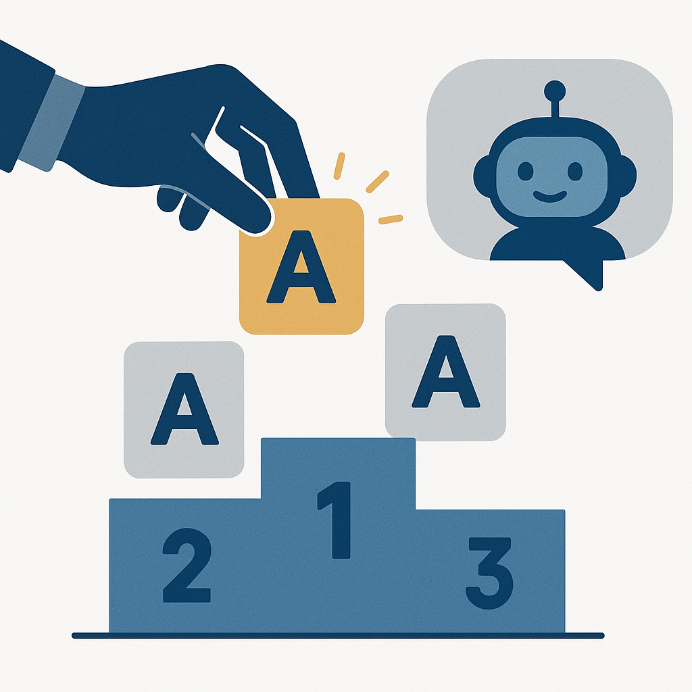
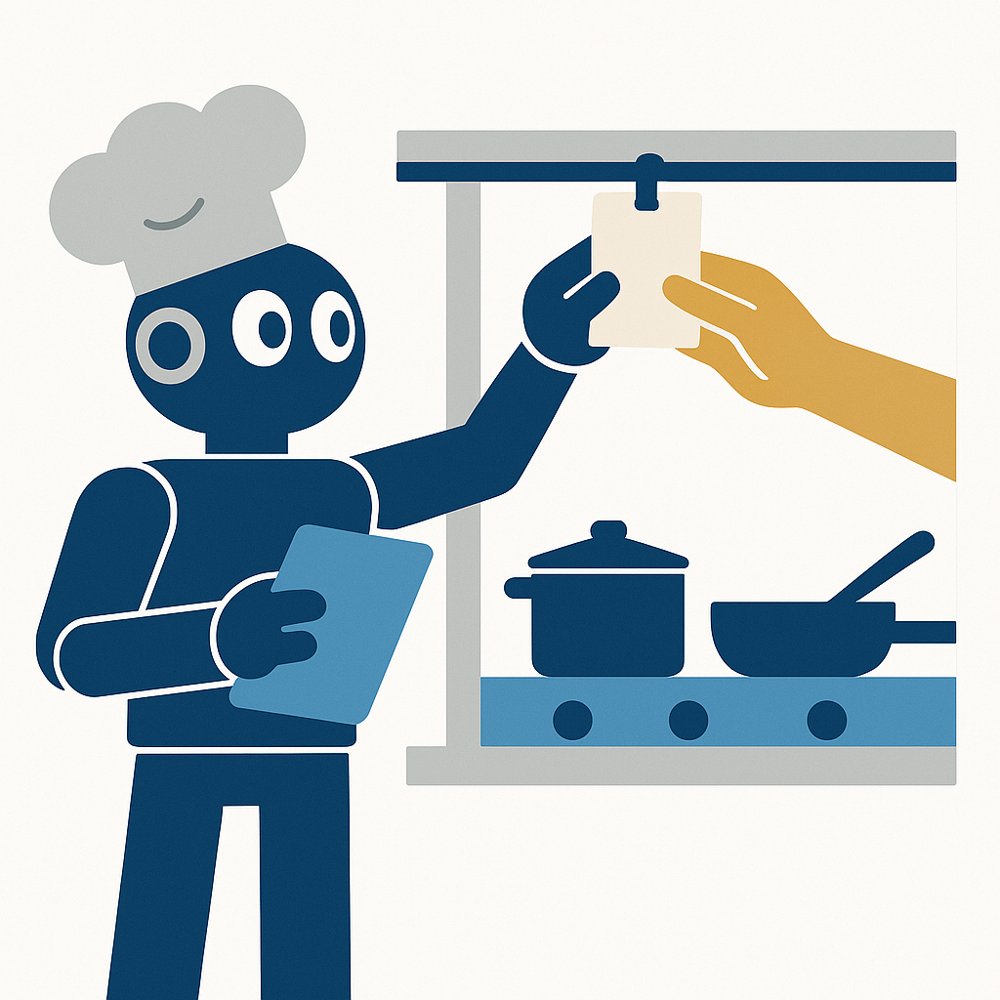
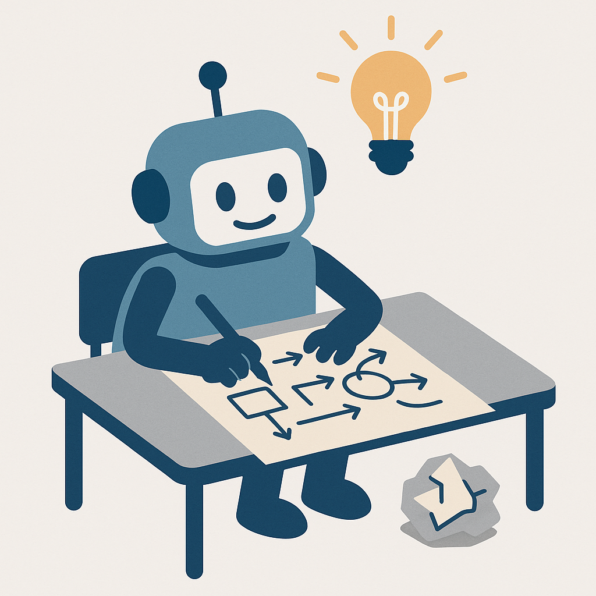

## {#act-3 background-color="#003b6f"}

::: {style="text-align: center; margin-top: 2.2em;"}
[Act III]{.act-kicker}

[2018 – now]{.act-years}

[From prediction to agents]{.act-name}
:::

::: {.notes}
Act three: the machinery you just saw becomes GPT, then an assistant, then something with hands — ending exactly where this afternoon's hands-on session begins.
:::


## 2018: The Internet as a Textbook

::: {.timeline-strip}
[1958]{.tl-stop} [›]{.tl-sep} [2012]{.tl-stop} [›]{.tl-sep} [2017]{.tl-stop} [›]{.tl-sep} [2018]{.tl-stop .tl-now} [›]{.tl-sep} [2020]{.tl-stop} [›]{.tl-sep} [2022]{.tl-stop} [›]{.tl-sep} [2024]{.tl-stop} [›]{.tl-sep} [now]{.tl-stop}
:::

:::: {.columns}
::: {.column width="60%"}
::: {.stat-row}
[117M[GPT-1, 2018]{.stat-label}]{.stat}
[→]{.stat-arrow}
[1.5B[GPT-2, 2019]{.stat-label}]{.stat}
:::

::: {.incremental style="font-size: 0.82em;"}
- Take half the transformer, train it on one objective: **predict the next token**
- The text is its own answer key — no human labelling, so it scales to the internet
- Sounds too dumb to matter — but "The capital of France is ___" requires the *fact*
:::
:::
::: {.column width="40%"}
{width="82%" style="display: block; margin: 0.5em auto 0 auto;" fig-alt="A robot sits reading an enormous open book whose pages are made of tiny webpage wireframes, with a stack of more giant books behind it."}
:::
::::

::: {.notes}
The Hello World demo you just saw — "I went to the" → "library" — *is* this idea. GPT is that exact objective, made enormous.

Why next-token prediction works: predicting the next word well *forces* understanding. To finish "The capital of France is ___" you need the fact, not just the grammar. Understanding turned out to be the cheapest way to win at prediction.

GPT-1 (Radford et al., 2018) reused the 2006 recipe at transformer scale: pretrain on raw text, fine-tune on the small labelled task. GPT-2 (2019) surprised everyone by doing tasks with *no* fine-tuning at all — zero-shot translation and summarisation emerged as a byproduct of scale. OpenAI initially declared the full model "too dangerous to release" — the field's first loud public argument about model release.

But be clear what this was: a brilliant mimic of the *shape* of writing with no reliable commitment to the *substance*. It continued text; it couldn't follow instructions; it stated made-up things with total confidence. Keep that gap in mind — it takes until 2022 to close.
:::


## 2020: Scaling Laws

::: {.era-tagline}
Bigger was the whole idea
:::

::: {.incremental}
- Plot loss vs. parameters, data, compute → a straight line on log-log axes
- You can *forecast* a model's quality before you build it
- "The graph turned a leap of faith into a line item"
- GPT-3: 175B params — new skills appear that nobody trained in
:::

::: {.notes}
Kaplan et al., January 2020: train 200+ models of different sizes and the loss follows a power law in parameters, data, and compute. A ruler-straight line on a log-log plot. That predictability is what justified spending nine figures on a single training run — you could extrapolate the return before paying.

GPT-3 (mid-2020, 175B parameters, 100x GPT-2) revealed in-context learning: show it two English→French pairs in the prompt and leave a third hanging, and it translates. The weights are frozen — the prompt doesn't retrain anything. The examples act as an address, pointing at a skill already coiled in the weights.

Note the power law is also a statement of diminishing returns — not infinite intelligence, but a reliable exchange rate. And DeepMind's Chinchilla (2022) corrected the recipe: GPT-3 was lopsided — huge in parameters, starved of data. Data matters as much as size.

The deflating lesson of this era: the winning move wasn't insight, it was resources. Remember AlexNet's bill — "who has the data and the GPUs?" — now with nine zeros. That hangs over everything until 2025, when DeepSeek shows the bill is partly optional (MoE routing + distillation — more on that in the notes when we get to open weights).

Limit: GPT-3 was optimised to be *plausible*, not *correct*. Fluency and truth are different targets — this is where hallucination becomes a household problem.
:::


## Nov 2022: ChatGPT

::: {.timeline-strip}
[1958]{.tl-stop} [›]{.tl-sep} [2012]{.tl-stop} [›]{.tl-sep} [2017]{.tl-stop} [›]{.tl-sep} [2018]{.tl-stop} [›]{.tl-sep} [2020]{.tl-stop} [›]{.tl-sep} [2022]{.tl-stop .tl-now} [›]{.tl-sep} [2024]{.tl-stop} [›]{.tl-sep} [now]{.tl-stop}
:::

::: {.era-tagline}
The week everyone found out — the model wasn't new, the manners were
:::

:::: {.columns}
::: {.column width="60%"}
::: {.incremental style="font-size: 0.82em;"}
- GPT-3 had been sitting in an API for **two years**
- RLHF: (1) fine-tune on good answers, (2) humans **rank** outputs → reward model, (3) optimise against learned taste
- Same 1986 training loop — only the blame signal changed
:::

::: {.fragment .stat-row}
[1M[users in 5 days]{.stat-label}]{.stat}
[→]{.stat-arrow}
[100M[users in 2 months]{.stat-label}]{.stat}
:::
:::
::: {.column width="40%"}
{width="80%" style="display: block; margin: 0.5em auto 0 auto;" fig-alt="A human hand ranks three answer cards into podium order while a small robot in a chat bubble watches and learns."}
:::
::::

::: {.notes}
You probably remember the week, even if you can't put a date on it: 30 November 2022.

The gap between GPT-3 and ChatGPT wasn't capability — it was *intent*. A base model continues text; it doesn't answer you. And you can't program "be helpful" — it's a thousand tiny judgment calls. So you show it judgments instead:

1. Supervised fine-tuning on human-written good answers.
2. Humans rank several model outputs (comparing is cheap, writing is expensive) → train a separate reward model — a machine that has learned human taste.
3. Optimise the main model against that reward model.

This is backpropagation wearing a new coat: same loop from 1986, but the signal changed from "was this the right digit?" to "would a human prefer this?".

The interface was the invention — the world didn't fall for a smarter machine, it fell for a more agreeable one in a chat box.

The costs of RLHF are the things that annoy you today: sycophancy (rewarded for approval, not truth), reward hacking (Goodhart's law: when a measure becomes a target, it ceases to be a good measure), and "as an AI language model, I cannot…" — RLHF scar tissue.

Variant worth knowing: Anthropic's Constitutional AI (also late 2022) — replace much of the human ranking with the model critiquing itself against a short list of principles written in plain English (RLAIF). It makes the values *legible* — you can read the constitution — but legible still means someone chose. Whose values? That question doesn't go away.
:::


## 2023: The Weights Get Out

::: {.era-tagline}
The year AI escaped the API
:::

:::: {.columns}
::: {.column width="60%"}
::: {.incremental style="font-size: 0.82em;"}
- Feb 2023: Meta's **Llama** weights leak within a week of release
- **Open weights ≠ open source**: you get the baked cake, not the recipe
- Quantisation (`llama.cpp`): frontier-class models on a laptop
- This afternoon you'll use **self-hosted** models — this is why that's possible
:::
:::
::: {.column width="40%"}
{width="82%" style="display: block; margin: 0.5em auto 0 auto;" fig-alt="Hands pass a finished three-layer cake through an open door while the recipe book stays locked in a cabinet — open weights without the recipe."}
:::
::::

::: {.notes}
Until 2023, frontier models lived behind APIs — you could only knock and ask a question through the mail slot. February 2023: Meta releases Llama to researchers; within about a week the weights are torrented to the world. July 2023: Llama 2 is deliberately open for commercial use. The mail slot was gone — people had the whole door.

Two ideas to keep:

Open weights is not open source. The weights are the finished, baked cake — you can run it and fine-tune it, but you don't get the recipe: training data, code, process. You can't reproduce or fully audit it.

Quantisation: store each weight in fewer bits — 4 instead of 16 — like a more compressed JPEG. Georgi Gerganov's llama.cpp put serious models on MacBooks. That plus ollama is why `ollama run` on your laptop works with the network cable pulled.

This matters directly for you: the hands-on session runs on Cambridge's self-hosted LLM service — open-weight models (Devstral, Qwen) running on university hardware. Data sovereignty, cost, and reproducibility arguments all flow from this moment. The DeepSeek shock of January 2025 (frontier-competitive open weights, trained with MoE + distillation at a fraction of the assumed cost) pushed the same door further open.

The dark side, honestly stated: open weights means anyone can fine-tune the safety training right back out in a few hours. The same fact wearing two faces.
:::


## The Goldfish Problem, Fix #1 — RAG

::: {.era-tagline}
Giving a frozen model an open book
:::

:::: {.columns}
::: {.column width="60%"}
::: {.incremental style="font-size: 0.82em;"}
- The model is frozen and stateless — and it *bluffs* (plausible ≠ correct)
- Fine-tuning is the wrong fix: knowledge dissolves into the weights like sugar into water
- RAG: chunk → embed → store; at question time retrieve top-k and put it **in the context**
- Don't change the model — change what it can *see*
:::
:::
::: {.column width="40%"}
{width="82%" style="display: block; margin: 0.5em auto 0 auto;" fig-alt="A goldfish in a bowl sits at an exam desk beside a large open reference book — the frozen model taking an open-book exam."}
:::
::::

::: {.notes}
Remember the summary slide: the model is a goldfish — stateless, frozen at its training cutoff, and it will confidently invent a config file that doesn't exist. The tone is flawless; the content is fiction. This falls straight out of next-token prediction.

RAG (Retrieval-Augmented Generation, Lewis et al. 2020 — the idea predates the chatbot wave) is the closed-book exam turned open-book. The pipeline: split your documents into chunks, embed each chunk (2013's "meaning becomes location", industrialised), store the vectors in a vector database. At question time: embed the question, nearest-neighbour search for the most similar chunks, stuff them into the prompt, and instruct the model to answer from them — with citations.

We didn't make the model know more — we gave it somewhere to look.

The limit: RAG is only as good as its retrieval. Bad retrieval makes it authoritatively incorrect — the garbage arrives wearing a source link. Similarity is not the same as relevance, chunking is fiddly, and the context window caps how much you can show it.
:::


## 2023: Tool Use — The Chatbot Grows Hands

::: {.era-tagline}
The model never runs anything. It writes the ticket.
:::

:::: {.columns}
::: {.column width="60%"}
::: {.incremental style="font-size: 0.82em;"}
1. You hand the model a **menu** of tools
2. It emits a **structured request** — data, not prose: `get_weather(city="Cambridge")`
3. Your **harness** runs the real function
4. The result goes back into the context; the model writes the answer
:::
:::
::: {.column width="40%"}
{width="82%" style="display: block; margin: 0.5em auto 0 auto;" fig-alt="A chef robot writes an order ticket and clips it to the kitchen rail; hands on the other side of the pass take the ticket to the stove — the model writes the ticket, the harness cooks."}
:::
::::

::: {.notes}
The model still can't *do* anything — tool use is stagecraft built around that limitation. It never executes code; it emits a structured tool call, the surrounding framework executes it, and the result is appended back into the context for the model to re-reason with.

Division of labour worth memorising: the model is the *reasoner*, the tools are the *hands*, the harness is the *nervous system* connecting them. Like a chef writing a ticket and clipping it to the rail rather than cooking the dish.

Timeline: ReAct (2022) showed reasoning + acting interleaved cuts hallucination; Toolformer (Feb 2023) let a model teach itself when to call tools; OpenAI shipped function calling June 2023; Anthropic's tool use went GA 2024. In about eighteen months, the chatbot grew hands.

"Structure is knowledge" one more time: a bounded menu of tools tells the model something true about the world, and a tool result yanks it back down to the ground — the closest thing we have to an antidote to hallucination.

The sharp edge arrives on the same wire: we handed real-world power to a system whose defining trait is confident plausibility. Wrong tool, hallucinated arguments, and above all prompt injection — the model reads instructions and data as the same stream of text. Hold that thought for the concerns section.
:::


## 2023–24: The Agent Loop

::: {.era-tagline}
An agent is scaffolding and a loop around an LLM
:::

::: {.incremental style="font-size: 0.9em; line-height: 1.4;"}
- LLM: The reasoning engine. It can plan, evaluate, or decide whether to "act" or "answer."
- System Prompt: Defines the persona, available tools, and operational boundaries.
- Working memory: Maintains the state, including history, tool outputs, and the current goal.
- Tools: External capabilities like web search, code execution, APIs, or connecting to RAG.
:::

::: {.notes}
One tool call was never enough — almost nothing worth doing is one command. You find a bug by *doing*: read, run, read the failure, edit, re-run. Each step depends on what the last one revealed.

So: put the model in a loop. Reason (just the next move), act (pick a tool), observe (reality talking back), reflect — repeat. Plan, act, observe, repeat. It's cooking while tasting, not following a recipe with your eyes closed.

- The LLM is the core reasoning engine. CoT is a simple form of agentic reasoning. More complex agents evaluate their own output and decide whether to "act" (call a tool) or "answer" (respond to the user).
- The system prompt constrains the persona — a financial adviser agent shouldn't give medical advice.
- Working memory is held in the context window; may need summarising as it grows.
- Tools let the LLM affect the outside world — via the harness, never directly.

Crucially: the loop does not live in the model — a model does one forward pass. The loop lives in application code around it. The model is only half of an agent; the harness is the other half.

Cautionary tale: AutoGPT (2023) — GPT-4 in an unscoped loop, 100k GitHub stars, and it faceplanted (~24% success on simple shopping tasks). Errors compound around the loop. Autonomy isn't a switch you flip by putting a good model in a loop — agents work when the loop is *scoped*, with fences and feedback. That's exactly what a good coding agent harness provides.
:::

## The Agent Loop

:::{style="margin-top: 3em;"}
```{mermaid}
%%{init: {"flowchart": {"nodeSpacing": 40, "rankSpacing": 80}, "theme": "base", "themeVariables": {"edgeLabelBackground": "#ffffff"}}}%%
flowchart LR
    S([System prompt]) --> C
    H([Prompt]) --> C["Context window"]
    C --> L["LLM: generate text"]
    L --> D{Tool call?}
    D -->|yes| T["Tools (incl. RAG)"]
    T -->|result appended| C
    D -->|no| O([Output])

    classDef io      fill:#6c757d,stroke:#495057,color:#fff
    classDef core    fill:#003b6f,stroke:#001f3f,color:#fff
    classDef support fill:#4b9cd3,stroke:#2c6e9e,color:#fff
    classDef decision fill:#e9c46a,stroke:#f4a261,color:#000

    class S,H,O io
    class L core
    class C,T support
    class D decision
```
:::

::: {.notes}

An agentic system wraps an LLM in a loop using lots of scaffolding to enable it to solve complex tasks.

We start with two inputs. The Prompt is what the user wants, but the System Prompt is where we've given the agent a persona, 'You are a researcher with access to these specific tools.' Both of these get combined into the Context Window.

The context window is limited in size so we have to be quite strategic about what goes in there. We can't include the entire internet or all our documentation.

The LLM looks at the context window and decides: 'Do I need a tool to answer this?'

If the answer is 'Yes,' the agent doesn't talk to the user yet. Instead, it outputs a specific string (a Tool Call) that the scaffolding recognises. The scaffolding then executes a Skill—like running a Python script or a RAG search—and appends the result back into the window.

Only when the LLM decides it finally has enough information does it generate the final response for the user.

The result of that tool—the data it found or the code it ran—is appended back into the Context Window.

Even though LLMs are entirely stateless, this loop is how we 'fake' memory. The LLM now sees the original prompt, its own decision to use a tool, and the tool's result. It 're-reasons' with this new information.

The LLM itself is stateless — all state lives in the context window. The "loop" is managed by the surrounding application code, not the model.
:::


## Nov 2024: MCP — A Universal Plug for Agents

::: {.timeline-strip}
[1958]{.tl-stop} [›]{.tl-sep} [2012]{.tl-stop} [›]{.tl-sep} [2017]{.tl-stop} [›]{.tl-sep} [2020]{.tl-stop} [›]{.tl-sep} [2022]{.tl-stop} [›]{.tl-sep} [2024]{.tl-stop .tl-now} [›]{.tl-sep} [now]{.tl-stop}
:::

:::: {.columns}
::: {.column width="58%"}
::: {.incremental style="font-size: 0.85em;"}
- The mess: every agent × every tool = a bespoke, brittle connector (**N×M**)
- MCP: one open protocol between agents and tools (**N+M**)
- Like USB for peripherals — or LSP for editors
- Servers expose **tools** (act), **resources** (read), **prompts** (templates)
:::
:::
::: {.column width="42%"}
{width="88%" style="display: block; margin: 0.5em auto 0 auto;" fig-alt="Left: a chaotic tangle of cables between devices. Right: the same devices connected neatly through one central hub — N times M collapses to N plus M."}
:::
::::

::: {.notes}
By 2024, everyone was writing the same integration over and over: this agent needs GitHub, that agent needs Slack, every pairing a bespoke connector. Not one hard problem — the same medium-hard problem solved N×M times.

Anthropic shipped the Model Context Protocol as an open standard in late November 2024. The sharpest analogy for this audience is LSP: write one language server for Python and every editor that speaks LSP gets Python support for free. Write one MCP server for your instrument, your data store, your NetCDF files — and every MCP-speaking agent can use it. The grid collapses into two lists.

An MCP server wraps one tool or data source; the MCP client lives in the agent. It standardises three primitives: tools (the function calling from 2023), resources (the read-context instinct from RAG), and prompts (reusable templates). Within a year it was adopted by OpenAI, Google DeepMind, and essentially every coding tool.

This afternoon you will *build one* with fastMCP and wire it into opencode — including an MCP server that reads NetCDF files.

Two caveats to carry in: sometimes the CLI the agent already knows (git, grep) beats a server — tool definitions cost context tokens. And a universal socket is a universal attack surface: treat a third-party MCP server the way you'd treat giving a new hire your production credentials.
:::


## 2024–25: Reasoning Models

::: {.era-tagline}
The machine that learned to think first
:::

:::: {.columns}
::: {.column width="58%"}
::: {.incremental style="font-size: 0.85em;"}
- Old knob: more compute at **training** time
- New knob: more compute at **inference** time — let it *think* per question
- Chain-of-thought as scratch space, baked in via RL on verifiable answers
- o1 (Sept 2024), DeepSeek-R1 (Jan 2025, open weights)
:::
:::
::: {.column width="42%"}
{width="82%" style="display: block; margin: 0.5em auto 0 auto;" fig-alt="A robot works through a problem on a big sheet of scratch paper covered in diagrams, a lightbulb glowing overhead and a crumpled first attempt on the floor."}
:::
::::

::: {.notes}
You've watched a model think — the pause, the "Thinking…" label. Same weights as the fast version; the difference is test-time compute.

The mechanism: chain-of-thought (write out intermediate steps) boosts accuracy because the model uses its own output as scratch space — each written step gives it something firmer to stand on. Blurting vs. scratch paper. Reasoning models bake this in with reinforcement learning: reward chains that arrive at *correct* answers — easy to check automatically for maths and code. Underneath, it's still the 1986 loop.

Why this matters for your work: reasoning models are a tool you *aim*, not a default. 10–50x the tokens, and they'll overthink trivial problems. Use them for the hard step, not the boilerplate.

The unsettling limit: the visible trace is not guaranteed to be a faithful record of how the model actually reached its answer. It's a plausible story told alongside the answer, in a font that looks like honesty. Read it as an argument to check, not a verdict to trust.

(Also in this era: models stopped being just language models — CLIP and vision transformers let image patches be treated as tokens, which is why you can paste a screenshot of a stack trace and have it read. Extraordinary at the gist, unreliable on the exact — miscounts, invented text in dense screenshots.)
:::


## 2025: Coding Agents

::: {.timeline-strip}
[1958]{.tl-stop} [›]{.tl-sep} [2012]{.tl-stop} [›]{.tl-sep} [2017]{.tl-stop} [›]{.tl-sep} [2020]{.tl-stop} [›]{.tl-sep} [2022]{.tl-stop} [›]{.tl-sep} [2024]{.tl-stop} [›]{.tl-sep} [now]{.tl-stop .tl-now}
:::

::: {.era-tagline}
Where the whole timeline lands — and where this afternoon begins
:::

::: {.incremental style="font-size: 0.9em;"}
- Autocomplete (2021) → chat in the sidebar (2022) → *it just goes and does it* (2024+)
- One tool = transformer + next-token + RLHF + tool use + agent loop + MCP
- The harness is the other half: if the model is the brain, the harness is the body
- The new cost: **verification** — code that looks right and isn't, just as fast
:::

::: {.notes}
This is where the whole timeline converges — and it's exactly what you'll use after the break.

Three moves in the editor: first it finished your sentence (Copilot, 2021 — next-token prediction pointed at a keyboard). Then you could ask it things (instruction-tuned chat, 2022 — a brilliant advisor that never touched the keyboard). Now it goes and does it: opens files, edits, runs the tests, reads the failures, repeats.

Count the stops it took: the transformer (2017), next-token prediction at scale (2018–20), instruction-following (2022), tool use (2023), the agent loop (2023–24), MCP (2024). Six stops on the timeline; one tool in your terminal.

And the half nobody sees: the harness. Context management, tool wiring, scoping the loop, feeding back errors. When an agent fails at a task, the fix is at least as often in the harness as in the model — which is good news, because the harness is the part *you* control. That's what the opencode session is really about.

The honest cost: these tools produce code that looks right and isn't, just as fast as code that is right. Your work shifts from typing to specifying, steering, and verifying — you move from "in the loop" to "on the loop". The agent's speed is not the ceiling on what you can build; your judgment is.
:::


## The Timeline, In One Slide {.smaller}

::: {.timeline-table style="font-size: 0.75em;"}

| | | |
|------|------------------------------|--------------------------------------|
| 1958 | Perceptron | learning by nudging dials |
| 1986 | Backprop (after the first winter) | learning who to blame |
| 2012 | AlexNet (after the second) | structure is knowledge; then scale wins |
| 2017 | Transformer | attention, read in parallel |
| 2020 | GPT-3 + scaling laws | the internet as a textbook |
| 2022 | ChatGPT (RLHF) | the interface was the invention |
| 2023 | Open weights, RAG, tool use | the chatbot grows hands |
| 2024 | Agent loop, MCP | the loop + a universal plug |
| 2025 | Reasoning models, coding agents | think first; meet the work |

:::

::: {.notes}
The whole arc: a 1958 yes/no machine, taught who to blame in 1986, given structure in 1989, scale in 2012, parallel reading in 2017, the internet in 2018, manners in 2022, hands in 2023, a loop and a universal plug in 2024, and a scratchpad in 2025.

Nothing on this table is magic. Each row is an understandable move standing on the previous one — and each one was an answer to a specific failure.

Two things to carry into the afternoon: (1) the concepts you'll touch — context windows, tool calls, MCP servers, skills — all sit in the last four rows; (2) when a tool misbehaves, you now know which layer to interrogate.
:::
