## 2017: Attention Is All You Need

::: {.timeline-strip}
[1958]{.tl-stop} [›]{.tl-sep} [1986]{.tl-stop} [›]{.tl-sep} [2012]{.tl-stop} [›]{.tl-sep} [2014]{.tl-stop} [›]{.tl-sep} [2017]{.tl-stop .tl-now} [›]{.tl-sep} [2020]{.tl-stop} [›]{.tl-sep} [2022]{.tl-stop} [›]{.tl-sep} [now]{.tl-stop}
:::

::: {.era-tagline}
The 2017 paper hiding inside every AI you use
:::

:::: {.columns}
::: {.column width="58%"}
::: {.incremental style="font-size: 0.85em;"}
- Eight Google researchers, writing a **translation** paper
- The reckless move: keep attention, **throw away the RNN**
- Every token attends to every other token — **in parallel**
- Parallel means GPUs saturate; GPUs saturating means **scale**
:::
:::
::: {.column width="42%"}
{width="82%" style="display: block; margin: 0.5em auto 0 auto;" fig-alt="Six word blocks arranged in a circle, every block connected to every other by thin lines, with one connection highlighted — every token attending to every other token."}
:::
::::

::: {.notes}
"Attention Is All You Need", Vaswani et al., 2017. Eight authors, listed as equal contributors, order randomised. They were trying to improve machine translation — none of them saw what it would become. It is now the blueprint for every AI you talk to: GPT literally stands for Generative Pretrained *Transformer*.

The move sounds absurd on paper: attention was invented as an accessory to the RNN — keeping it while dropping the RNN is like keeping the GPS and getting rid of the car. But it works, because self-attention alone can capture the relationships that matter, and without recurrence the whole sequence processes simultaneously.

That's the deep connection back to 2012: AlexNet proved GPUs + scale win, but RNNs couldn't use that hardware — they read one word at a time. The transformer is the architecture that finally let language soak up all the compute. "Structure is knowledge" again: the structure a language model needs is attention plus a sense of position, and almost nothing else needs to be hard-wired.

Now let's open the box and walk through exactly what happens at inference time — this machinery is running every time you watch a model answer token by token.
:::


<!-- SIMPLE ABSTRACTION -->

## Transformers: Inference I {auto-animate=true}

:::: {.columns}
::: {.column width="60%"}
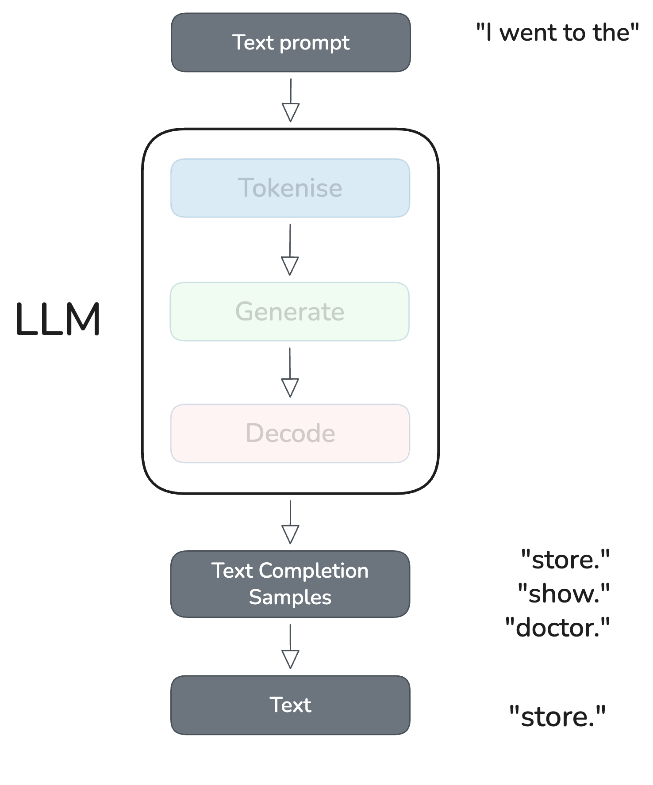{width="70%" data-id="basic-inference-img"}
:::
::: {.column width="40%"}
:::
::::

## Transformers: Inference I {auto-animate=true}

:::: {.columns}
::: {.column width="60%"}
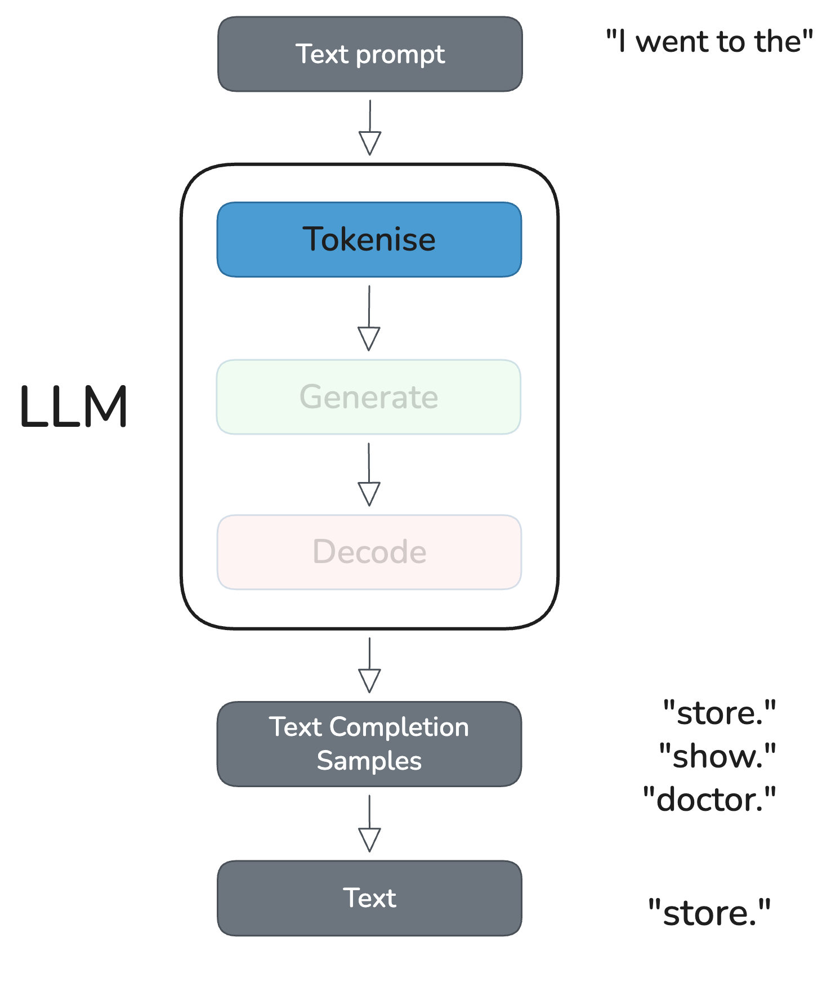{width="70%" data-id="basic-inference-img"}
:::
::: {.column width="40%"}
::: {style="font-size: 0.8em; color: #555; margin-top: 4em;"}
Convert text to tokens
:::
:::
::::

## Transformers: Inference I {auto-animate=true}

:::: {.columns}
::: {.column width="60%"}
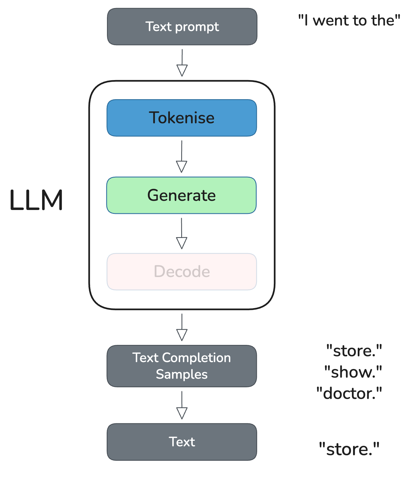{width="70%" data-id="basic-inference-img"}
:::
::: {.column width="40%"}
::: {style="font-size: 0.8em; color: #555; margin-top: 4em;"}
Convert text to tokens
:::
::: {style="font-size: 0.8em; color: #555; margin-top: 1.25em;"}
Predict new tokens
:::
:::
::::

:::{.notes}
This box is doing a lot of work, but we can break it down (in the next section) into a few key steps:
:::

## Transformers: Inference I {auto-animate=true}

:::: {.columns}
::: {.column width="60%"}
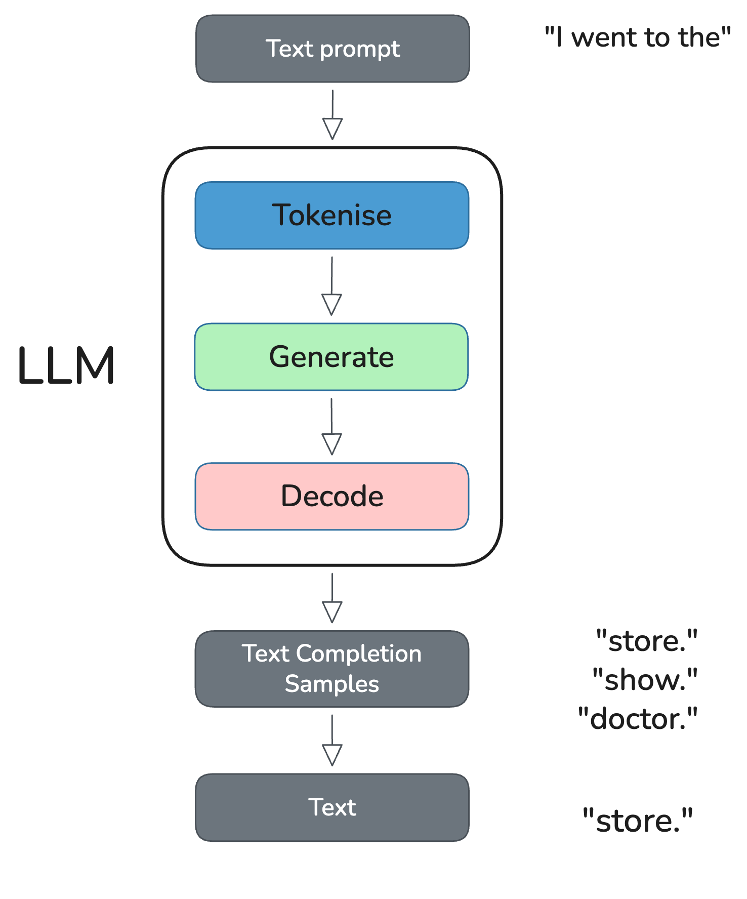{width="70%" data-id="basic-inference-img"}
:::
::: {.column width="40%"}
::: {style="font-size: 0.8em; color: #555; margin-top: 4em;"}
Convert text to tokens
:::
::: {style="font-size: 0.8em; color: #555; margin-top: 1.25em;"}
Predict new tokens
:::
::: {style="font-size: 0.8em; color: #555; margin-top: 1.25em;"}
Convert tokens to text
:::
:::
::::


<!-- COMPLEX ABSTRACTION -->

## Transformers: Inference II {auto-animate=false}

{width="40%" style="display: block; margin: 0 auto;" data-id="inference-img"}

## Transformers: Inference II {auto-animate=false}

:::: {.columns}
::: {.column width="40%"}
{width="100%" style="display: block; margin: 0 auto;" data-id="inference-img"}
:::
::: {.column width="60%"}
:::{style="margin-top: 3em; font-family: monospace; font-size: 0.85em;"}
"I went to the"
:::
:::{style="display: flex; gap: 0.4em; margin-top: 0.8em; font-family: monospace; font-size: 0.8em;"}
[I]{style="background:#4b9cd3; color:#fff; padding: 0.2em 0.6em; border-radius: 4px;"}
[▁went]{style="background:#4b9cd3; color:#fff; padding: 0.2em 0.6em; border-radius: 4px;"}
[▁to]{style="background:#4b9cd3; color:#fff; padding: 0.2em 0.6em; border-radius: 4px;"}
[▁the]{style="background:#4b9cd3; color:#fff; padding: 0.2em 0.6em; border-radius: 4px;"}
:::
:::
::::

## Transformers: Inference II {auto-animate=false}

:::: {.columns}
::: {.column width="40%"}
{width="100%" style="display: block; margin: 0 auto;" data-id="inference-img"}
:::
::: {.column width="60%"}
:::{style="margin-top: 3em; font-family: monospace; font-size: 0.85em;"}
"backpropagation"
:::
:::{style="display: flex; gap: 0.4em; margin-top: 0.8em; font-family: monospace; font-size: 0.8em;"}
[▁back]{style="background:#4b9cd3; color:#fff; padding: 0.2em 0.6em; border-radius: 4px;"}
[prop]{style="background:#4b9cd3; color:#fff; padding: 0.2em 0.6em; border-radius: 4px;"}
[agation]{style="background:#4b9cd3; color:#fff; padding: 0.2em 0.6em; border-radius: 4px;"}
:::
:::{style="font-size: 0.65em; color: #555; margin-top: 0.5em;"}
3 tokens
:::
:::
::::

## Transformers: Inference II {auto-animate=true}

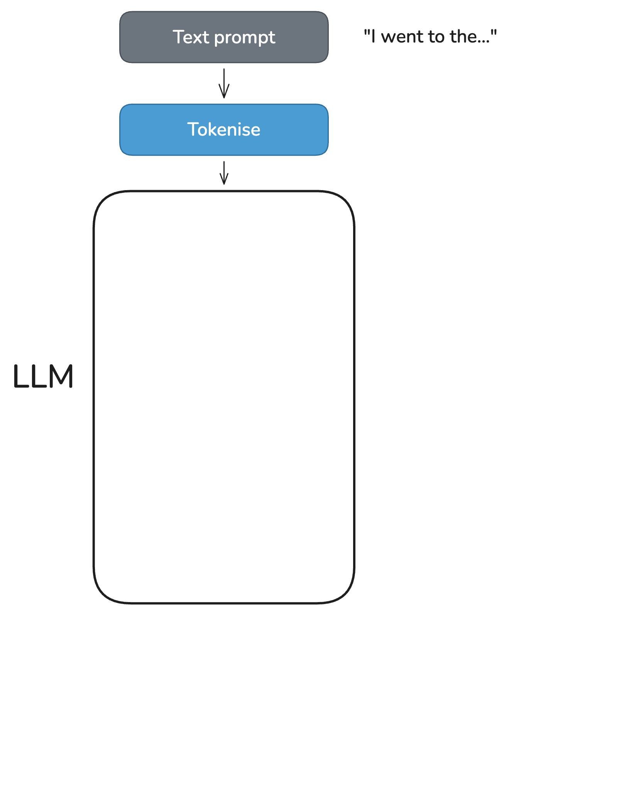{width="40%" style="display: block; margin: 0 auto;" data-id="inference-img"}

:::{.notes}
This is the LLM - the tokenizer sits outside of the model. 

Converts to token ids. 
:::

## Transformers: Inference II {auto-animate=true}

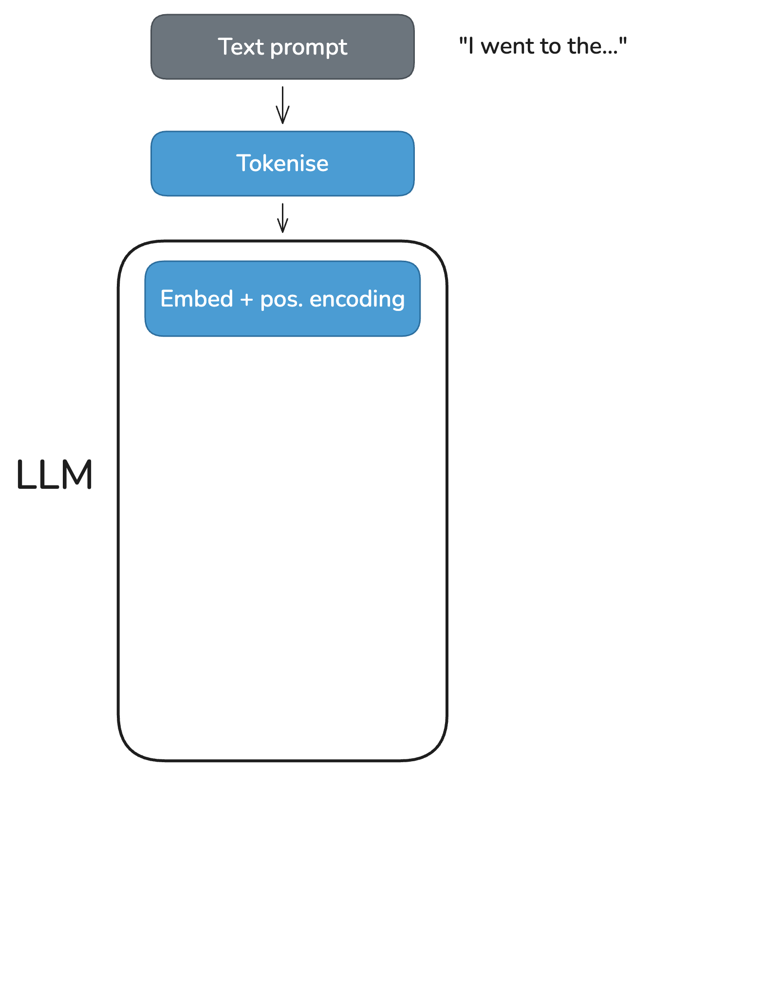{width="40%" style="display: block; margin: 0 auto;" data-id="inference-img"}

:::{.notes}
begin by mapping token IDs to dense vectors using the embedding matrix. 
This is obtained during training and captures the static meaning of each token. 
:::

## Transformers: Inference II {auto-animate=false}

:::: {.columns}
::: {.column width="35%"}
{width="100%" style="display: block; margin: 0 auto;" data-id="inference-img"}
:::
::: {.column width="65%"}
:::{style="font-family: monospace; font-size: 0.65em; margin-top: 2em; color: #333;"}
| Token | ID | Embedding (2048 dims) |
|-------|-----|----------------------|
| I | 235285 | [ 0.21, -0.83, 0.54, 0.12, ... ] |
| ▁went | 3806 | [ -0.44, 0.31, 0.09, -0.77, ... ] |
| ▁to | 576 | [ 0.67, 0.02, -0.51, 0.38, ... ] |
| ▁the | 573 | [ 0.55, -0.19, 0.73, -0.02, ... ] |
:::
:::
::::

<!-- ::: {style="text-align: center; font-size: 0.6em; color: #555; margin-top: 0.4em;"}
::: -->
:::{.notes}


Each token ID maps to a vector of numbers. A positional signal is added so the model
knows the order of tokens — "I went to the" is different from "the to went I".
:::

## Transformers: Inference II {auto-animate=true}

{width="40%" style="display: block; margin: 0 auto;" data-id="inference-img"}

## Transformers: Inference II {auto-animate=true}

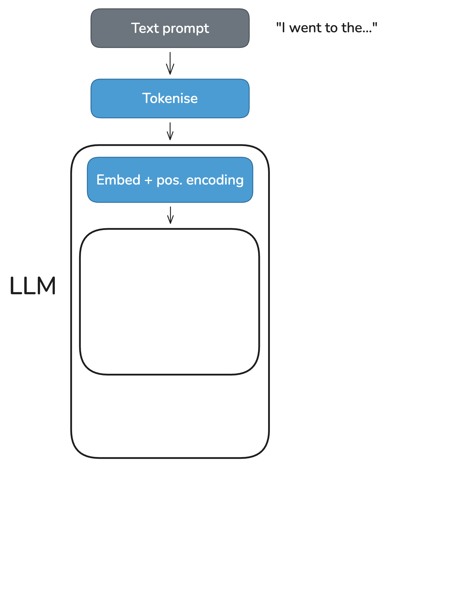{width="40%" style="display: block; margin: 0 auto;" data-id="inference-img"}

:::{style="position: absolute; top: 55%; left: 65%; font-size: 0.75em; color: #003b6f;"}
transformer block
:::


## Transformers: Inference II {auto-animate=true}
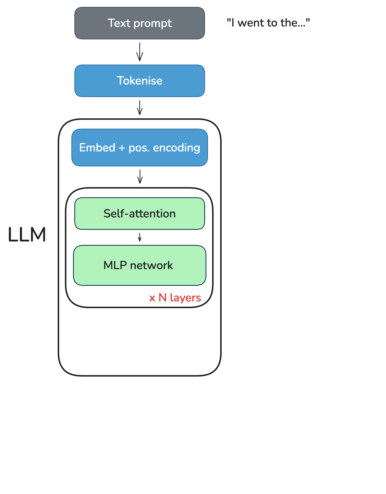{width="100%" style="display: block; margin: 0 auto;" data-id="inference-img"}

:::{style="position: absolute; top: 55%; left: 65%; font-size: 0.75em; color: #003b6f;"}
transformer block
:::

:::{.notes}
The transformer block is where all the interesting stuff happens. The key idea is self-attention: rather than processing tokens in sequence (like an RNN), every token attends to every other token in parallel.

This endows the embedding vectors with contextual information.

This lets the model capture long-range dependencies and scales well on modern hardware.

The MLP layers are a little different in that they capture facts and rules of language. 
:::

## Self-attention {auto-animate=false}

:::: {.columns}
::: {.column width="40%"}
{width="100%" style="display: block; margin: 0 auto;" data-id="inference-img"}
:::
::: {.column width="60%"}
:::{style="text-align: center; margin-top: 2em; font-size: 1.0em; line-height: 3;"}
[I]{style="background:#4b9cd3; color:#fff; padding: 0.2em 0.5em; border-radius: 4px;"}
[went]{style="background:#4b9cd3; color:#fff; padding: 0.2em 0.5em; border-radius: 4px;"}
[to]{style="background:#e9c46a; padding: 0.2em 0.5em; border-radius: 4px;"}
[the]{style="color:#aaa; padding: 0.2em 0.5em;"}
:::
:::{style="text-align: center; font-size: 0.7em; color: #555;"}
"I" ↔ "went": subject-verb &nbsp;&nbsp;|&nbsp;&nbsp; "went" → "to": verb-preposition
:::
:::
::::

::: {.notes}

Let's look at a few examples:

The attention scores determine how much each token "looks at" the others when building its contextual representation. Syntactic example: "I" and "went" are linked by subject-verb agreement; "went" and "to" by verb-preposition dependency.

:::

## Self-attention {auto-animate=false}

:::: {.columns}
::: {.column width="40%"}
{width="100%" style="display: block; margin: 0 auto;" data-id="inference-img"}
:::
::: {.column width="60%"}
:::{style="text-align: center; margin-top: 2em; font-size: 1.0em; line-height: 3;"}
"The [bank]{style="background:#e9c46a; padding: 0.2em 0.5em; border-radius: 4px;"} by the [river]{style="background:#4b9cd3; color:#fff; padding: 0.2em 0.5em; border-radius: 4px;"} was steep"
:::
:::{style="text-align: center; font-size: 0.7em; color: #555;"}
"bank" attends strongly to "river" - meaning is of a riverbank, not financial
:::
:::
::::

::: {.notes}

  and similarly, "bank" attends strongly to "river" so its output vector shifts toward the riverbank meaning rather than the financial one.

  attention builds up lots of these relationships. 
:::

## Transformers: Inference II {auto-animate=true}

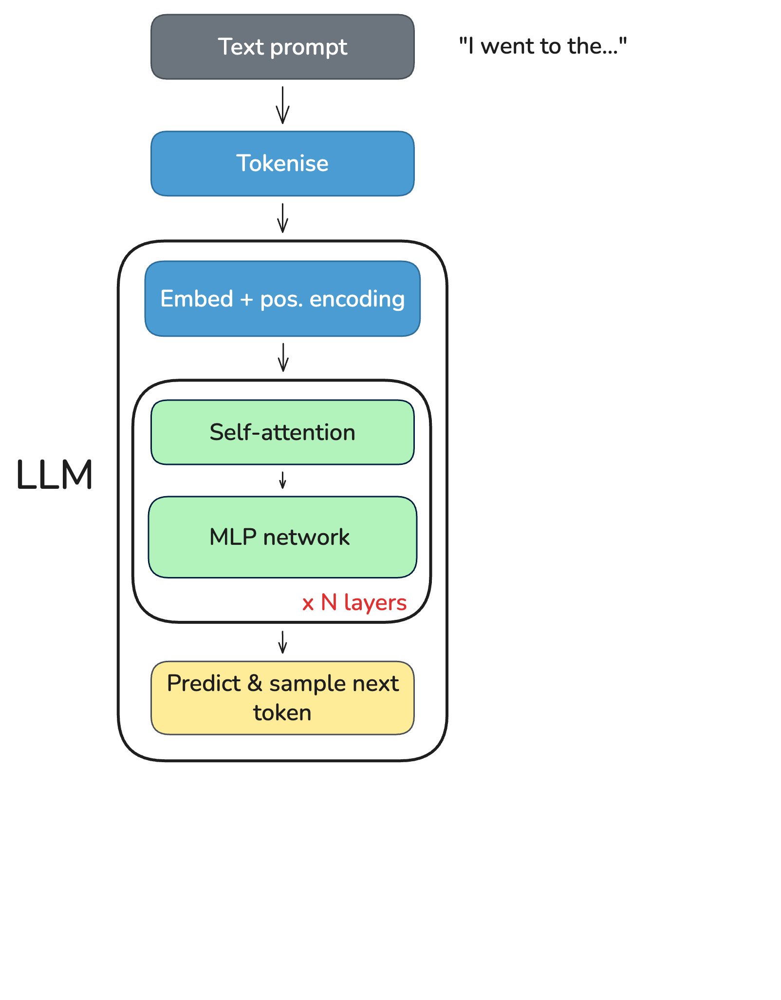{width="40%" style="display: block; margin: 0 auto;" data-id="inference-img"}

## Transformers: Inference II {auto-animate=true}

:::: {.columns}
::: {.column width="40%"}
{width="100%" style="display: block; margin: 0 auto;" data-id="inference-img"}
:::
::: {.column width="60%"}
:::{style="font-family: monospace; font-size: 0.72em; margin-top: 1.5em; color: #333;"}
▁the → [ 0.55, -0.19, 0.73, ... ]

× unembedding matrix (2048 × 256k)

→ logits for every token in vocab

→ softmax → sample
:::
:::{style="font-family: monospace; font-size: 0.75em; margin-top: 1em; color: #333;"}
| Token | Probability |
|-------|------------|
| ▁library | 31% |
| ▁store | 18% |
| ▁park | 12% |
| ▁doctor | 8% |
:::
:::{style="font-size: 0.65em; color: #555; margin-top: 0.5em;"}
Only "the" matters — contextualised by attention.
:::
:::
::::

::: {.notes}

At this point the word 'the' has been enriched with context by attention. 

The model then applies the unembedding matrix to this vector, giving a score (logit) for every token in the vocabulary.

Basically a dot product similarity between the contextualised vector and the vocab vectors. 

softmax converts these logits to probabilities, and the model samples the next token ID from this distribution.  

During inference, we actually do this for every token in the sequence. This is obviously inefficient. 

Get around this with a concept called KV caching, but that's a topic for another day.

Why is there a limit on context length?

:::

## Transformers: Inference II {auto-animate=true}

{width="40%" style="display: block; margin: 0 auto;" data-id="inference-img"}

## Transformers: Inference II {auto-animate=true}

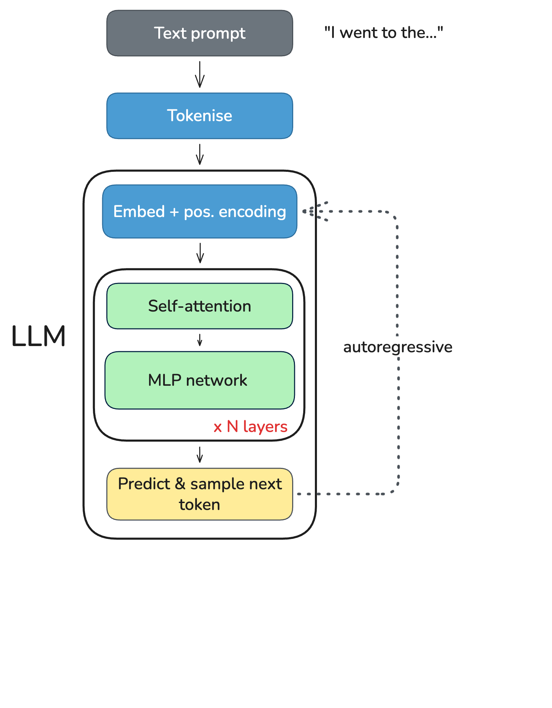{width="40%" style="display: block; margin: 0 auto;" data-id="inference-img"}

:::{.notes}
This is run autoregressively.

Autoregressive is a fancy way of saying "feed the output back in as input." Each iteration appends the new token ID to the sequence and feeds the full sequence back in. Eventually the model generates an end-of-sequence token or hits max_new_tokens.

Maybe my arrow is a little misleading here. 
:::

## Transformers: Inference II {auto-animate=true}

:::: {.columns}
::: {.column width="40%"}
{width="100%" style="display: block; margin: 0 auto;" data-id="inference-img"}
:::
::: {.column width="60%"}
:::{style="font-family: monospace; font-size: 0.6em; margin-top: 2em; line-height: 2.2; color: #333;"}
[235285] [3806] [576] [573] → **4376 "▁library"**

[235285] [3806] [576] [573] [4376] → **736 "▁this"**
:::
:::{style="font-size: 0.65em; color: #555; margin-top: 0.5em;"}
full sequence fed back in each loop
:::
:::
::::

::: {.notes}
Each iteration appends the new token ID to the sequence and feeds the full sequence back in. Eventually the model generates an end-of-sequence token or hits max_new_tokens.

- Since the model processes the entire sequence on every forward pass, so longer inputs require more computation and memory. This is a fundamental limitation of the transformer architecture - it's obviously inefficent to re-process the same tokens every time.
- It was also trained on sequences up to a certain length (e.g. 2048 tokens), so it may not perform well on much longer inputs.
- kv caching grows as O(n)
- computation grows as O(n^2) due to self-attention

:::

## Transformers: Inference II {.nostretch auto-animate=true}

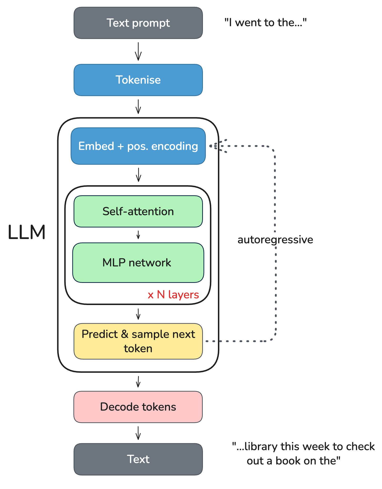{width="36%" style="display: block; margin: 0 auto;" data-id="inference-img"}

## Transformers: Inference II {auto-animate=true}

:::: {.columns}
::: {.column width="40%"}
{width="100%" style="display: block; margin: 0 auto;" data-id="inference-img"}
:::
::: {.column width="60%"}
:::{style="font-family: monospace; font-size: 0.62em; margin-top: 2em; line-height: 2; color: #333;"}
[235285, 3806, 576, 573, 4376, 736]

↓ vocab lookup

"I went to the library this"
:::
:::{style="font-size: 0.65em; color: #555; margin-top: 0.5em;"}
just a lookup table, the inverse of tokenisation
:::
:::
::::

::: {.notes}
- Tokenise: text to sub-word token IDs
- LLM: token IDs enter the model
- Embed + pos. encoding: token IDs to dense vectors with position
- Self-attention + MLP × N layers: every token attends to every other
- Predict & sample: logits to softmax to sample next token
- Autoregressive: feed token back, repeat
- Decode: token IDs to text

The crucial innovation is self-attention: rather than processing tokens in sequence (like an RNN), every token attends to every other token in parallel. This lets the model capture long-range dependencies and scales well on modern hardware.

Sampling strategies: the model doesn't always pick the most likely next token. Temperature scales the probability distribution (higher = more random). Top-k restricts sampling to the k most likely tokens. Top-p (nucleus sampling) samples from the smallest set of tokens whose cumulative probability exceeds p.
:::

## Transformers: Summary

::: {.incremental style="font-size: 0.9em;"}
- Tokenise: text → sub-word token IDs
- Embed: token IDs → dense vectors (static meaning)
- Self-attention: enrich each vector with context (dynamic meaning)
  - MLP × N layers: transform representations
- Predict & sample: last token's vector × unembedding matrix → next token ID
- Autoregressive loop: append token, feed full sequence back in
- Decode: token IDs → text (lookup table)
:::

::: {.notes}
The key insight: the embedding matrix gives every token a static starting vector, and self-attention makes those vectors contextual. The model is stateless — all state lives in the sequence of token IDs fed in on each loop. 

:::

## Transformers: Summary {auto-animate=true}

::: {.incremental}
- The model is completely stateless
- All context is in the text fed to it, there is no memory
- Each forward pass re-processes the full sequence
- Longer contexts are more expensive: attention is O(n²)
:::

::: {.notes}
This has profound implications for how you use LLMs.

Long conversations get expensive because the full history is re-processed every time.

Context length is a hard constraint. Techniques like RAG, summarisation, and memory modules are all workarounds for this fundamental limitation.

In summary: it's essentially a goldfish.

:::

<!-- CODE EXAMPLE  -->

## LLM Hello World {.smaller auto-animate=true}

```{.python}
import os
from huggingface_hub import login
from transformers import AutoTokenizer, AutoModelForCausalLM

login(token=os.environ["HF_API_KEY"], add_to_git_credential=True)

tokenizer = AutoTokenizer.from_pretrained("google/gemma-2b")

model = AutoModelForCausalLM.from_pretrained("google/gemma-2b")

input_text = "I went to the"
input_ids = tokenizer(input_text, return_tensors="pt")

outputs = model.generate(**input_ids, max_new_tokens=10, do_sample=True, top_p=0.9)
print(tokenizer.decode(outputs[0]))
```

## LLM Hello World {.smaller auto-animate=true}

```{.python code-line-numbers="1-3"}
import os
from huggingface_hub import login
from transformers import AutoTokenizer, AutoModelForCausalLM

login(token=os.environ["HF_API_KEY"], add_to_git_credential=True)

tokenizer = AutoTokenizer.from_pretrained("google/gemma-2b")

model = AutoModelForCausalLM.from_pretrained("google/gemma-2b")

input_text = "I went to the"
input_ids = tokenizer(input_text, return_tensors="pt")

outputs = model.generate(**input_ids, max_new_tokens=10, do_sample=True, top_p=0.9)
print(tokenizer.decode(outputs[0]))
```

:::{style="font-size: 0.75em; line-height: 1.4;"}
- **`huggingface_hub` / `transformers`**: The platform and library where the ML community collaborates on models, datasets, and applications.
:::

## LLM Hello World {.smaller auto-animate=true}

```{.python code-line-numbers="5"}
import os
from huggingface_hub import login
from transformers import AutoTokenizer, AutoModelForCausalLM

login(token=os.environ["HF_API_KEY"], add_to_git_credential=True)

tokenizer = AutoTokenizer.from_pretrained("google/gemma-2b")

model = AutoModelForCausalLM.from_pretrained("google/gemma-2b")

input_text = "I went to the"
input_ids = tokenizer(input_text, return_tensors="pt")

outputs = model.generate(**input_ids, max_new_tokens=10, do_sample=True, top_p=0.9)
print(tokenizer.decode(outputs[0]))
```

:::{style="font-size: 0.75em; line-height: 1.4;"}
- **`huggingface_hub` / `transformers`**: The platform and library where the ML community collaborates on models, datasets, and applications.
- **Login**: Register with Hugging Face and obtain a key to download hosted models.
:::

## LLM Hello World {.smaller auto-animate=true}

```{.python code-line-numbers="7,9"}
import os
from huggingface_hub import login
from transformers import AutoTokenizer, AutoModelForCausalLM

login(token=os.environ["HF_API_KEY"], add_to_git_credential=True)

tokenizer = AutoTokenizer.from_pretrained("google/gemma-2b")

model = AutoModelForCausalLM.from_pretrained("google/gemma-2b")

input_text = "I went to the"
input_ids = tokenizer(input_text, return_tensors="pt")

outputs = model.generate(**input_ids, max_new_tokens=10, do_sample=True, top_p=0.9)
print(tokenizer.decode(outputs[0]))
```

:::{style="font-size: 0.75em; line-height: 1.4;"}
- **`huggingface_hub` / `transformers`**: The platform and library where the ML community collaborates on models, datasets, and applications.
- **Login**: Register with Hugging Face and obtain a key to download hosted models.
- **Load tokenizer & model**: Downloads Google Gemma-2b and its matching tokenizer.
:::

## LLM Hello World {.smaller auto-animate=true}

```{.python code-line-numbers="11-12"}
import os
from huggingface_hub import login
from transformers import AutoTokenizer, AutoModelForCausalLM

login(token=os.environ["HF_API_KEY"], add_to_git_credential=True)

tokenizer = AutoTokenizer.from_pretrained("google/gemma-2b")

model = AutoModelForCausalLM.from_pretrained("google/gemma-2b")

input_text = "I went to the"
input_ids = tokenizer(input_text, return_tensors="pt")

outputs = model.generate(**input_ids, max_new_tokens=10, do_sample=True, top_p=0.9)
print(tokenizer.decode(outputs[0]))
```

:::{style="font-size: 0.75em; line-height: 1.4;"}
- **`huggingface_hub` / `transformers`**: The platform and library where the ML community collaborates on models, datasets, and applications.
- **Login**: Register with Hugging Face and obtain a key to download hosted models.
- **Load tokenizer & model**: Downloads Google Gemma-2b and its matching tokenizer.
- **Tokenise input**: Converts your text into a tensor of token IDs the model can read.
:::

## LLM Hello World {.smaller auto-animate=true}

```{.python code-line-numbers="14-15"}
import os
from huggingface_hub import login
from transformers import AutoTokenizer, AutoModelForCausalLM

login(token=os.environ["HF_API_KEY"], add_to_git_credential=True)

tokenizer = AutoTokenizer.from_pretrained("google/gemma-2b")

model = AutoModelForCausalLM.from_pretrained("google/gemma-2b")

input_text = "I went to the"
input_ids = tokenizer(input_text, return_tensors="pt")

outputs = model.generate(**input_ids, max_new_tokens=10, do_sample=True, top_p=0.9)
print(tokenizer.decode(outputs[0]))
```

:::{style="font-size: 0.75em; line-height: 1.4;"}
- **`huggingface_hub` / `transformers`**: The platform and library where the ML community collaborates on models, datasets, and applications.
- **Login**: Register with Hugging Face and obtain a key to download hosted models.
- **Load tokenizer & model**: Downloads Google Gemma-2b and its matching tokenizer.
- **Tokenise input**: Converts your text into a tensor of token IDs the model can read.
- **Generate & decode**: Model predicts tokens autoregressively; tokenizer converts them back to text.
:::

:::{.notes}

By writing model.generate(**input_ids), you are telling Python: "Take every key in this dictionary and pass it to the function as a named argument."


:::