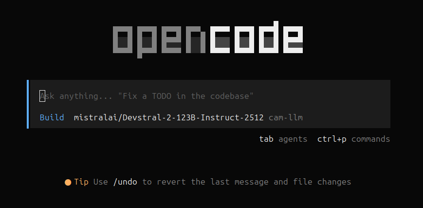
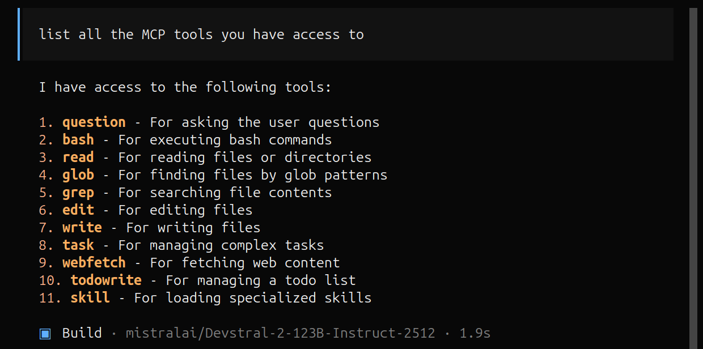

# Tools and Workflows

## Opencode (CLI) {.nostretch}

In this half of the training we will make use of [`opencode`](https://opencode.ai/)

:::{.r-stack .center}
{width=80%}
:::

Concepts can also be applied to similar tools e.g., VSCode, GitHub Copilot CLI etc.

## Context Engineering

- LLMs are powerful, but suffer from context bloat
- Context window is finite resource
- LOTR + Hobbit ~ 750k tokens / 100k LOC ~ 1M tokens

| Model Name                       | Context Size   |
| :------------------------------- | -------------: |
| `Claude 4.6 Opus`                | 1M             |
| `Gemini 3.1 Pro`                 | 1M – 10M       |
| `GPT-5.3-Codex`                  | 400k           |
| `Devstral-2-123B-Instruct-2512`  | 256k           |
<!-- : Context lengths for SOTA and self-hosted models -->

## Solution

To resolve this issue, Anthropic open-sourced 2 methods:

- [Model Context Protocol](https://modelcontextprotocol.io/docs/getting-started/intro) (MCP) [November 2024]
- [Agent Skills](https://agentskills.io/what-are-skills) [December 2025]

## MCP

- Open-source standard
- Connect LLMs to external systems


## MCP examples {.nostretch}

- For example, `opencode` supports 11 built-in skills (see [docs](https://opencode.ai/docs/tools#built-in))

{width=80%}

LLMs can answer questions, but cannot interact with your system.

## MCP examples {.nostretch}

We will build our own using [`fastMCP`](https://fastmcp.wiki/en/getting-started/welcome)

```python
from fastmcp import FastMCP

mcp = FastMCP("add-server")

@mcp.tool
def add(a: int, b: int) -> int:
  """Add two numbers"""
  return a + b

if __name__ == "__main__":
  mcp.run()
```

## Skills

## Anatomy of a Skill

```
my-skill/             # Required: unique skill name e.g., [my-skill]
├── SKILL.md          # Required: instructions + metadata
├── scripts/          # Optional: executable code
├── references/       # Optional: documentation
└── assets/           # Optional: templates, resources
```

## Opencode Installation

Installation instructions [here](https://opencode.ai/download)

- Linux

```bash
curl -fsSL https://opencode.ai/install | bash
```

- Mac

```bash
brew install --cask opencode-desktop
```

- Windows (download `.exe`)


##
