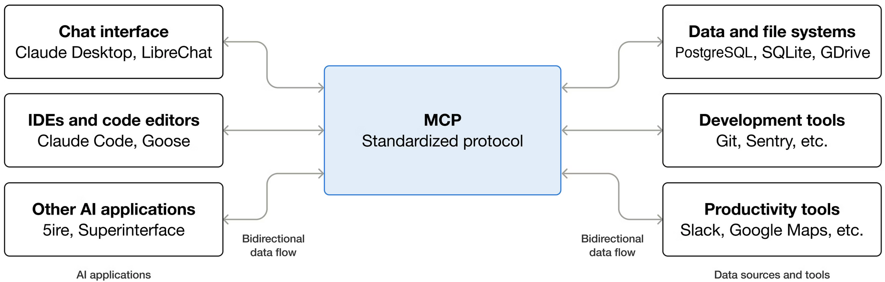
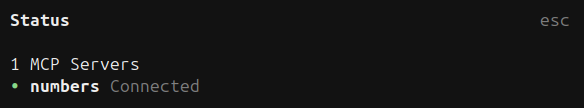
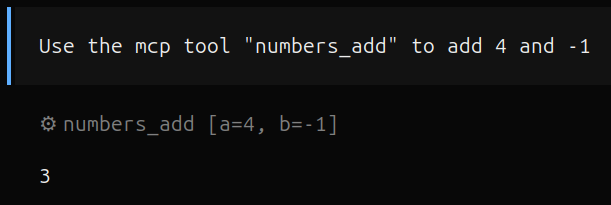
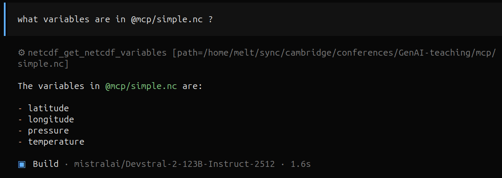
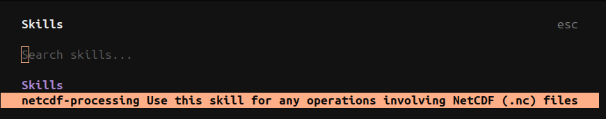
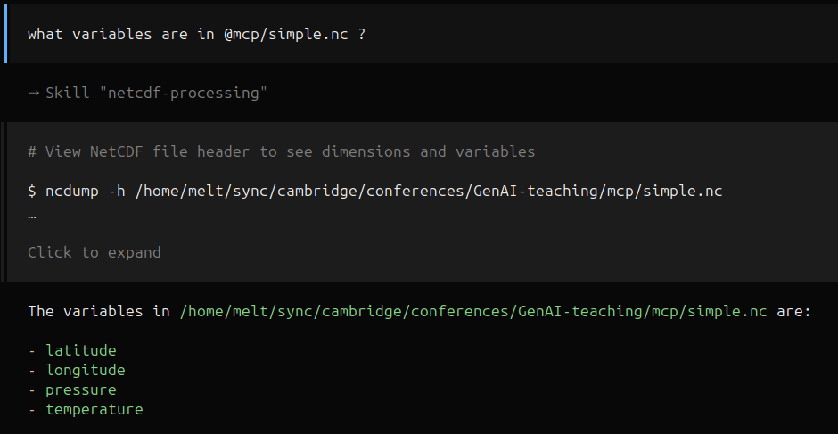
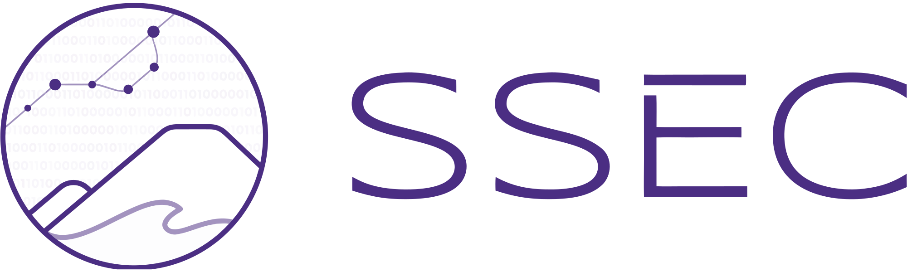

# Tools and Workflows

## Opencode (CLI) {.nostretch}

In this half of the training we will make use of [`opencode`](https://opencode.ai/)

{width=70% fig-align="center"}

Concepts can also be applied to similar tools e.g., VSCode, GitHub Copilot CLI etc.

## Opencode Installation

Installation instructions [here](https://opencode.ai/download)

- Linux

```bash
curl -fsSL https://opencode.ai/install | bash
```

- Mac

```bash
brew install anomalyco/tap/opencode
```

- Windows (download `.exe`)


## Opencode Configuration

We now need to configure `opencode` to run self-hosted LLMs

1. Add API key to `.basrhc` (or equivalent) e.g., <br>`export CAMLLM_API_KEY=sk-XXXXXXXXXXXXXXXXXXXXXX`
1. Configure `opencode` (see next slide)

::: {.callout-note}
If you already have access to UoC's LiteLLM
([https://llm.hpc.cam.ac.uk](https://llm.hpc.cam.ac.uk)) you can create one
from the virtual keys page: `Virtual Keys` $\rightarrow$ `Create New Key`.
:::

## Opencode Configuration

- edit/create `~/.config/opencode/opencode.json`

```json {filename=~/.config/opencode/opencode.json}
{
  "$schema": "https://opencode.ai/config.json",
  "provider": {
    "cam-llm": {
      "options": {
        "baseURL": "https://llm.science.ai.cam.ac.uk/v1",
        "apiKey": "{env:CAMLLM_API_KEY}"
      },
      "models": {
        "Qwen/Qwen3.6-27B-FP8": {
          "name": "Qwen/Qwen3.6-27B-FP8",
          "modalities": { "input": ["text", "image"], "output": ["text"] }
        },
      }
    }
  },
  "permission": {
    "bash": { "*": "ask" },
    "edit": { "*": "allow" }
  }
}
```

## Context Engineering

- LLMs are powerful, but suffer from context bloat
- Context window is finite resource
- LOTR + Hobbit ~ 750k tokens / 100k LOC ~ 1M tokens

| Model Name                       | Context Size   |
| :------------------------------- | -------------: |
| `Claude 4.6 Opus`                | 1M             |
| `Gemini 3.1 Pro`                 | 1M – 10M       |
| `GPT-5.3-Codex`                  | 400k           |
| `Devstral-2-123B-Instruct-2512`  | 256k           |
<!-- : Context lengths for SOTA and self-hosted models -->

## Solution

To resolve this issue, Anthropic open-sourced 2 methods:

- [Model Context Protocol](https://modelcontextprotocol.io/docs/getting-started/intro) (MCP) [November 2024]
- [Agent Skills](https://agentskills.io/what-are-skills) [December 2025]

## MCP

- Open-source standard
- Connect LLMs to external systems



## MCP examples {.nostretch}

For example, `opencode` supports 11 built-in skills (see [docs](https://opencode.ai/docs/tools#built-in))

::: {.callout-note}
LLMs can answer questions, but cannot interact with your system.
:::

{width=70% fig-align="center"}


## MCP example (add)

We will build our own using [`fastMCP`](https://fastmcp.wiki/en/getting-started/welcome)

```python {filename=mcp-numbers.py}
from fastmcp import FastMCP

mcp = FastMCP(name="mcp-numbers")

@mcp.tool
def add(a: int, b: int) -> int:
  """Add two numbers"""
  return a + b

if __name__ == "__main__":
  mcp.run()
```

## MCP example (add) {.nostretch}

1. Now let's add `mcp-numbers` to our `opencode` configuration
1. Follow instructions in `mcp/README.md`
1. Running `/status` in `opencode` should display
   {width=40%}
4. Try `Use mcp tool "numbers_add" to add 4 and -1`
   {width=40%}

## MCP examples (netcdf)

- What about a more interesting example...
- Can we give LLM power to inspect netcdf `.nc` files?
- Let's try with MCP.

## MCP examples (netcdf)

- Inspect file `mcp/mcp-netcdf.py`

```python {filename="../mcp/mcp-netcdf.py"}

```

## MCP examples (netcdf)

- `mcp/mcp-netcdf.py` contains 2 MCP tools
  - `netcdf_get_variables`
  - `netcdf_get_variable_shape` (to be implemented)
- Try using `netcdf_get_variables` on file `simple.nc` {width=70%}

## MCP examples (netcdf)

- Implement `netcdf_get_variable_shape`
- See stub in `mcp/mcp-netcdf.py`

```python {filename="../mcp/mcp-netcdf.py"}
@mcp.tool()
def get_variable_shape(path: str, variable_name: str) -> dict:
    """
    Reads a NetCDF file from the given path and returns the shape of a specific
    variable.
    ...
    """
    pass
```


(15 minutes for exercise)

## Skills

- Define reusable behavior via `SKILL.md` definitions
- Agent skills let LLMs discover reusable instructions
- Skills are loaded **on-demand**
- Skills are "just" markdown files

## Anatomy of a Skill

- Many genAI tools support skills e.g., Claude code, opencode, codex etc.

::: {.callout-note}
`opencode` requires that skills are stored in a specific set of locations (A
full list can be found [here](https://opencode.ai/docs/skills#place-files)). We
will focus on these:

- Project config: `.opencode/skills/<name>/SKILL.md`
- Global config: `~/.config/opencode/skills/<name>/SKILL.md`
:::

```
<name>/               # Required: unique skill name
├── SKILL.md          # Required: instructions + metadata
├── scripts/          # Optional: executable code
├── references/       # Optional: documentation
└── assets/           # Optional: templates, resources
```

## Skills Example (netcdf) {.nostretch}

- Let's refactor our netcdf MCP tool as a skill
- Follow instructions in `skill/README.md`:
```bash
cd project/root/GenAI-teaching
mkdir -p .opencode/skills/netcdf
ln -sf $(pwd)/skill/netcdf/SKILL.md .opencode/skills/netcdf/
```
- Run `/skills` in `opencode` to check registration
  {width=70%}

## Skills Example (netcdf) {.nostretch}

```markdown {code-line-numbers="false" filename=skill/netcdf/SKILL.md}

```

## Skills Example (netcdf) {.nostretch}


Try running the following command

::: {.callout-note}
**Disable netcdf MCP server** before trying to test the skill. They may conflict.
:::

{width=70% fig-align="center"}

## Skills Exercise

- Create your own `SKILL.md`
- Register it in opencode
- Try using it

(15 minutes for exercise)

## CLI {.center}

Do we really need MCP or Skills?...

## CLI

- Common CLI tools are already in model weights
- No authentication
- No configuration

## CLI

- Try asking model to run CLI commands
- Don't need to be specific e.g., "are there any untracked files in this repo?"
- What issues do you foresee?

(5 minutes for exercise)

## MCP vs CLI vs Skill

So how do I choose between MCP, CLI and Skills?

::: {style="font-size: 50%;"}

|                 | MCP Server                                                                                               | CLI                                                                                 | `SKILL.md` (Instruction)                                                 |
| --              | ----                                                                                                     | ----                                                                                | ----                                                                     |
| Primary Purpose | **Tool calling** -- Need auth, permissions, audit trails, or remote access? Is data format important?    | **Raw commands** -- Run terminal tools the model already knows (git, grep, docker). | **Domain Expertise** -- Provides workflows, rules, and domain knowledge. |
| Context/Loading | **Loaded immediately** into context window (regardless of query) reducing effective context window size. | **Zero cost** -- Knowledge is baked into model weights; no schemas loaded.          | **Lazy loaded** when needed. Will still impact context window.           |
| Timeout         | **Timeout ~ 1-2 minutes**. Ideal for short, quick function calls                                         | **No timeout**.                                                                     | **No timeout**.                                                          |

:::

::: {.callout-note}
For a more in-depth comparison check out Cordero's article ["MCP vs CLI: What Your Agents Should Be Using"](https://medium.com/@cdcore/mcp-vs-cli-what-your-agents-should-be-using-69eeb71828a9?sk=5beebb4e0f67b2f5a27845cdb1c50f7a)
:::

## Taking it further

- `opencode` and other genAI tools often support agents/sub-agents (see [docs](https://opencode.ai/docs/agents/#subagents))
- Agents are specialized AI assistants that can be configured for specific tasks and workflows
- They allow you to create focused tools with custom prompts, models, and tool access
- More markdown :eyes:

## Sub-Agent

- Let's create a sub-agent to generate PR messages
- Use `opencode agent create`
- Try creating your own
- Modify it and see what difference it makes

(15 minutes for exercise)

# Thanks for listening

::: {.partner-logos}
{height=90}
{height=90}
{height=90}
:::
